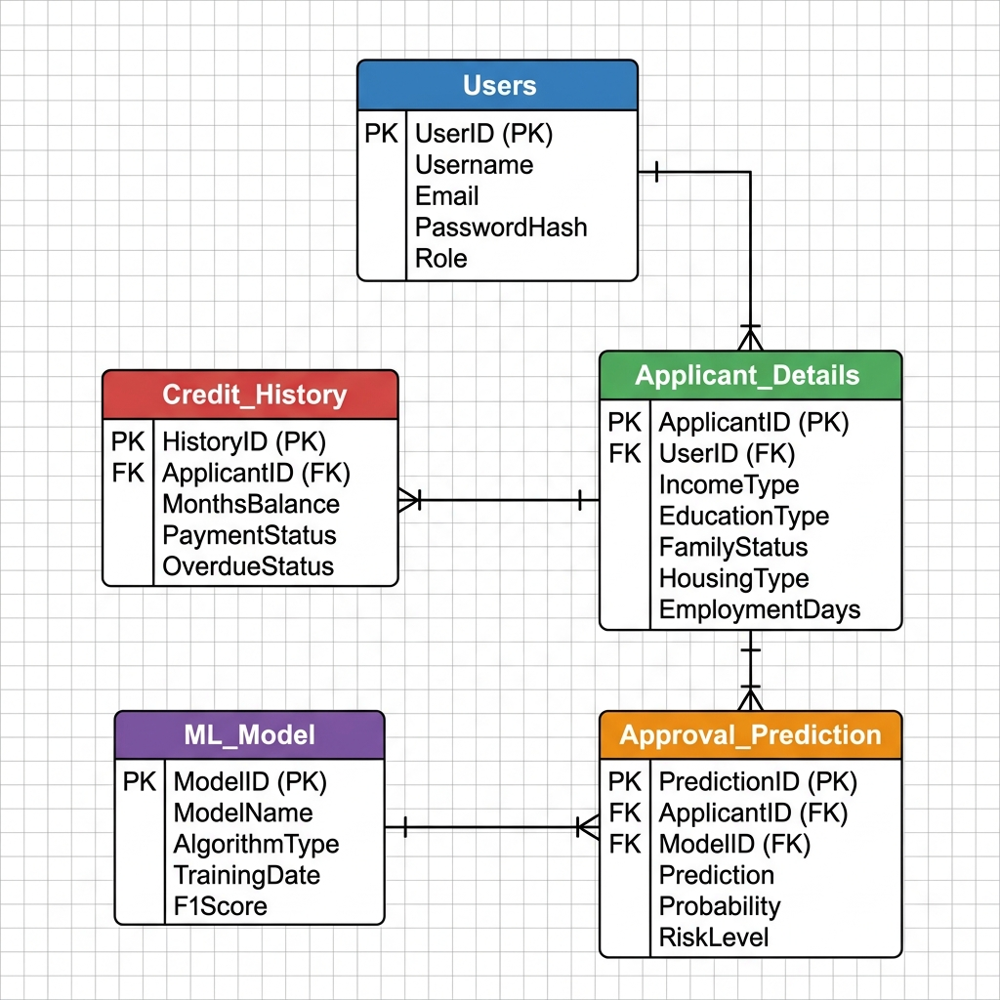

# 🗄️ CreditGuard AI — Database Design Document

## 📋 Overview
CreditGuard AI is a production-grade ML-powered credit card approval prediction system. This document presents the complete database design following Third Normal Form (3NF) with Crow's Foot ER notation. The system uses a dual-backend architecture (PostgreSQL/Supabase for production, SQLite for local development).

## 🏗️ Entity-Relationship Diagram


The 5 entities in the ENHANCED/NORMALIZED design are:
1. **users** — Authentication & authorization
2. **applicant_details** — Normalized applicant demographics, financial, and employment data
3. **credit_history** — Separated credit history data per applicant
4. **ml_model** — Model registry tracking versions, algorithms, training dates, and scores
5. **approval_prediction** — Prediction results linking applicants to model outputs

## 🔗 Entity Relationships

| Relationship | Cardinality | Description |
|---|---|---|
| users → applicant_details | One-to-Many (1:N) | A registered user can submit multiple credit applications |
| applicant_details → credit_history | One-to-One (1:1) | Each application has exactly one credit history snapshot |
| applicant_details → approval_prediction | One-to-Many (1:N) | An application can be re-evaluated by different model versions |
| ml_model → approval_prediction | One-to-Many (1:N) | A model version produces predictions for many applications |

**users to applicant_details**: A registered user (such as a loan officer or customer) can submit many different credit applications over time. However, each application is associated with exactly one submitting user.

**applicant_details to credit_history**: Each application details record has exactly one corresponding credit history profile capturing the credit-specific snapshot at the time of the application.

**applicant_details to approval_prediction**: A single application might be evaluated multiple times, perhaps by different models or re-run later, resulting in multiple prediction records. Each prediction belongs to one application.

**ml_model to approval_prediction**: A single machine learning model version can generate predictions for thousands of applications, while each individual prediction is produced by exactly one specific model version.

## 📝 Entity Descriptions

### users
- **Purpose**: Stores authentication credentials, basic profile information, and roles.
- **Business Logic**: Manages user access, handles Role-Based Access Control (RBAC), and keeps track of login timestamps.
- **ML Pipeline Role**: Tracks which user initiated a prediction request for auditing and accountability.
- **Importance**: Critical for system security, data privacy, and auditing user actions.

### applicant_details
- **Purpose**: Contains the normalized demographic, financial, and employment information of applicants.
- **Business Logic**: Serves as the core dataset for an application, feeding into the risk assessment process.
- **ML Pipeline Role**: Provides the raw input features required by the machine learning models.
- **Importance**: Central to the system; holds the primary data evaluated for creditworthiness.

### credit_history
- **Purpose**: Separates credit-specific historical metrics from general applicant demographics.
- **Business Logic**: Evaluates past financial behavior, separating current application details from historical performance.
- **ML Pipeline Role**: Contributes crucial predictive features (like default counts and utilization) to the model.
- **Importance**: Essential for accurate risk modeling and maintaining a 3NF normalized schema.

### ml_model
- **Purpose**: Acts as a registry for trained machine learning models, storing their metadata and performance metrics.
- **Business Logic**: Controls which model is currently active for live predictions.
- **ML Pipeline Role**: Tracks the lifecycle of models, supporting versioning, comparison, and rollback.
- **Importance**: Enables governance, reproducibility, and monitoring of ML assets.

### approval_prediction
- **Purpose**: Records the outputs of model inference, including probabilities, decisions, and explanations.
- **Business Logic**: Represents the final decision output presented to the user.
- **ML Pipeline Role**: Serves as a historical log of model behavior for performance monitoring and drift detection.
- **Importance**: Vital for audit trails, compliance, and user feedback.

## 📖 Data Dictionary

### users
| Field Name | Data Type | Description | PK | FK | Nullable | Example Value |
|---|---|---|---|---|---|---|
| id | SERIAL | Auto-incremented user identifier | ✅ | — | No | 1 |
| username | VARCHAR(100) | Unique login handle | — | — | No | "john_doe" |
| email | VARCHAR(255) | Unique email address | — | — | No | "john@example.com" |
| password_hash | VARCHAR(255) | Scrypt-hashed password | — | — | No | "scrypt:32768:8:1$..." |
| full_name | VARCHAR(255) | Display name | — | — | Yes | "John Doe" |
| role | VARCHAR(50) | RBAC role (Admin/Officer/User) | — | — | No | "User" |
| created_at | TIMESTAMP | Account creation timestamp | — | — | No | "2026-07-15 10:30:00" |
| last_login | TIMESTAMP | Most recent login time | — | — | Yes | "2026-07-16 08:00:00" |
| status | VARCHAR(50) | Account status | — | — | No | "Active" |
| is_admin | BOOLEAN | Admin flag for quick checks | — | — | No | FALSE |

### applicant_details
| Field Name | Data Type | Description | PK | FK | Nullable | Example Value |
|---|---|---|---|---|---|---|
| id | SERIAL | Auto-incremented record identifier | ✅ | — | No | 1 |
| application_id | VARCHAR(50) | Unique application reference code | — | — | No | "APP-482731" |
| user_id | INTEGER | Submitting user reference | — | ✅ → users.id | Yes | 3 |
| submitted_at | TIMESTAMP | Submission timestamp | — | — | No | "2026-07-15 14:22:00" |
| gender | VARCHAR(10) | Applicant gender | — | — | No | "M" |
| age_years | DECIMAL(5,2) | Applicant age in years | — | — | Yes | 35.50 |
| annual_income | DECIMAL(12,2) | Total annual income | — | — | No | 180000.00 |
| employment_type | VARCHAR(100) | Employment category | — | — | No | "Full-time" |
| years_employed | DECIMAL(5,2) | Years of employment | — | — | Yes | 8.50 |
| children_count | INTEGER | Number of children | — | — | No | 2 |
| family_members | INTEGER | Total family size | — | — | No | 4 |
| education_type | VARCHAR(100) | Highest education level | — | — | Yes | "Higher education" |
| family_status | VARCHAR(50) | Marital/family status | — | — | Yes | "Married" |
| housing_type | VARCHAR(100) | Housing arrangement | — | — | Yes | "House / apartment" |
| income_type | VARCHAR(100) | Source of income | — | — | Yes | "Commercial associate" |
| owns_car | BOOLEAN | Vehicle ownership flag | — | — | No | TRUE |
| owns_realty | BOOLEAN | Real estate ownership flag | — | — | No | TRUE |
| existing_debt | DECIMAL(12,2) | Current outstanding debt | — | — | Yes | 5000.00 |
| loan_amount_requested | DECIMAL(12,2) | Requested loan amount | — | — | Yes | 15000.00 |

### credit_history
| Field Name | Data Type | Description | PK | FK | Nullable | Example Value |
|---|---|---|---|---|---|---|
| id | SERIAL | Auto-incremented record identifier | ✅ | — | No | 1 |
| application_id | VARCHAR(50) | Parent application reference | — | ✅ → applicant_details.application_id | No | "APP-482731" |
| credit_score_band | VARCHAR(50) | Credit quality classification | — | — | No | "Good" |
| existing_loan_count | INTEGER | Number of active loans | — | — | Yes | 2 |
| payment_default_count | INTEGER | Historical payment defaults | — | — | Yes | 0 |
| credit_utilization_pct | DECIMAL(5,2) | Credit utilization percentage | — | — | Yes | 45.20 |
| credit_history_years | INTEGER | Length of credit history | — | — | Yes | 8 |

### ml_model
| Field Name | Data Type | Description | PK | FK | Nullable | Example Value |
|---|---|---|---|---|---|---|
| id | SERIAL | Auto-incremented model identifier | ✅ | — | No | 1 |
| model_name | VARCHAR(100) | Human-friendly model name | — | — | No | "Logistic Regression" |
| model_version | VARCHAR(20) | Semantic version tag | — | — | Yes | "1.0.0" |
| algorithm_type | VARCHAR(100) | Algorithm class name | — | — | No | "LogisticRegression" |
| training_date | TIMESTAMP | Date model was trained | — | — | Yes | "2026-07-01 00:00:00" |
| accuracy_score | DECIMAL(5,4) | Overall accuracy metric | — | — | Yes | 0.8650 |
| f1_score | DECIMAL(5,4) | Minority-class F1-Score | — | — | Yes | 0.8420 |
| precision_score | DECIMAL(5,4) | Precision metric | — | — | Yes | 0.8300 |
| recall_score | DECIMAL(5,4) | Recall metric | — | — | Yes | 0.8540 |
| training_samples | INTEGER | Number of training samples | — | — | Yes | 25000 |
| feature_count | INTEGER | Number of input features | — | — | Yes | 13 |
| is_active | BOOLEAN | Currently deployed flag | — | — | No | TRUE |
| serialized_path | VARCHAR(500) | Pickle file path | — | — | Yes | "models/best_model.pkl" |

### approval_prediction
| Field Name | Data Type | Description | PK | FK | Nullable | Example Value |
|---|---|---|---|---|---|---|
| id | SERIAL | Auto-incremented prediction identifier | ✅ | — | No | 1 |
| application_id | VARCHAR(50) | Parent application reference | — | ✅ → applicant_details.application_id | No | "APP-482731" |
| model_id | INTEGER | Model that produced this prediction | — | ✅ → ml_model.id | No | 1 |
| prediction | VARCHAR(50) | Binary decision output | — | — | No | "Approved" |
| approval_probability | DECIMAL(5,4) | Approval probability (0-1) | — | — | No | 0.8750 |
| risk_level | VARCHAR(50) | Computed risk classification | — | — | No | "Low Risk" |
| confidence_score | DECIMAL(5,4) | Model confidence level | — | — | Yes | 0.9200 |
| recommendation | TEXT | Human-readable recommendation | — | — | No | "Application approved with standard terms" |
| explanation | TEXT | LIME/Ridge surrogate explanation JSON | — | — | Yes | "{\"factors\": [...]}" |
| predicted_at | TIMESTAMP | Prediction timestamp | — | — | No | "2026-07-15 14:22:05" |

## 🗃️ SQL Table Schema (DDL)

*Note: The following uses PostgreSQL syntax for the production environment. A compatible SQLite schema is used for local fallback development.*

```sql
-- Users Table
CREATE TABLE users (
    id SERIAL PRIMARY KEY,
    username VARCHAR(100) UNIQUE NOT NULL,
    email VARCHAR(255) UNIQUE NOT NULL,
    password_hash VARCHAR(255) NOT NULL,
    full_name VARCHAR(255),
    role VARCHAR(50) NOT NULL DEFAULT 'User',
    created_at TIMESTAMP NOT NULL DEFAULT CURRENT_TIMESTAMP,
    last_login TIMESTAMP,
    status VARCHAR(50) NOT NULL DEFAULT 'Active',
    is_admin BOOLEAN NOT NULL DEFAULT FALSE,
    CONSTRAINT chk_role CHECK (role IN ('Admin', 'Officer', 'User')),
    CONSTRAINT chk_status CHECK (status IN ('Active', 'Inactive', 'Suspended'))
);
COMMENT ON TABLE users IS 'Authentication and authorization details for platform users.';

-- Applicant Details Table
CREATE TABLE applicant_details (
    id SERIAL PRIMARY KEY,
    application_id VARCHAR(50) UNIQUE NOT NULL,
    user_id INTEGER REFERENCES users(id) ON DELETE SET NULL,
    submitted_at TIMESTAMP NOT NULL DEFAULT CURRENT_TIMESTAMP,
    gender VARCHAR(10) NOT NULL,
    age_years DECIMAL(5,2),
    annual_income DECIMAL(12,2) NOT NULL,
    employment_type VARCHAR(100) NOT NULL,
    years_employed DECIMAL(5,2),
    children_count INTEGER NOT NULL DEFAULT 0,
    family_members INTEGER NOT NULL DEFAULT 1,
    education_type VARCHAR(100),
    family_status VARCHAR(50),
    housing_type VARCHAR(100),
    income_type VARCHAR(100),
    owns_car BOOLEAN NOT NULL DEFAULT FALSE,
    owns_realty BOOLEAN NOT NULL DEFAULT FALSE,
    existing_debt DECIMAL(12,2),
    loan_amount_requested DECIMAL(12,2),
    CONSTRAINT chk_income CHECK (annual_income >= 0)
);
CREATE INDEX idx_applicant_details_app_id ON applicant_details(application_id);
COMMENT ON TABLE applicant_details IS 'Normalized demographic, financial, and employment data for applications.';

-- Credit History Table
CREATE TABLE credit_history (
    id SERIAL PRIMARY KEY,
    application_id VARCHAR(50) UNIQUE NOT NULL REFERENCES applicant_details(application_id) ON DELETE CASCADE,
    credit_score_band VARCHAR(50) NOT NULL,
    existing_loan_count INTEGER DEFAULT 0,
    payment_default_count INTEGER DEFAULT 0,
    credit_utilization_pct DECIMAL(5,2),
    credit_history_years INTEGER,
    CONSTRAINT chk_utilization CHECK (credit_utilization_pct >= 0 AND credit_utilization_pct <= 100)
);
COMMENT ON TABLE credit_history IS 'Credit-specific historical metrics tied to an application.';

-- ML Model Table
CREATE TABLE ml_model (
    id SERIAL PRIMARY KEY,
    model_name VARCHAR(100) NOT NULL,
    model_version VARCHAR(20),
    algorithm_type VARCHAR(100) NOT NULL,
    training_date TIMESTAMP DEFAULT CURRENT_TIMESTAMP,
    accuracy_score DECIMAL(5,4),
    f1_score DECIMAL(5,4),
    precision_score DECIMAL(5,4),
    recall_score DECIMAL(5,4),
    training_samples INTEGER,
    feature_count INTEGER,
    is_active BOOLEAN NOT NULL DEFAULT FALSE,
    serialized_path VARCHAR(500)
);
CREATE INDEX idx_ml_model_active ON ml_model(is_active);
COMMENT ON TABLE ml_model IS 'Registry for trained machine learning models and performance metrics.';

-- Approval Prediction Table
CREATE TABLE approval_prediction (
    id SERIAL PRIMARY KEY,
    application_id VARCHAR(50) NOT NULL REFERENCES applicant_details(application_id) ON DELETE CASCADE,
    model_id INTEGER NOT NULL REFERENCES ml_model(id) ON DELETE RESTRICT,
    prediction VARCHAR(50) NOT NULL,
    approval_probability DECIMAL(5,4) NOT NULL,
    risk_level VARCHAR(50) NOT NULL,
    confidence_score DECIMAL(5,4),
    recommendation TEXT NOT NULL,
    explanation TEXT,
    predicted_at TIMESTAMP NOT NULL DEFAULT CURRENT_TIMESTAMP,
    CONSTRAINT chk_prob CHECK (approval_probability >= 0 AND approval_probability <= 1)
);
CREATE INDEX idx_prediction_app_id ON approval_prediction(application_id);
COMMENT ON TABLE approval_prediction IS 'Output of model inference linked to applications and models.';
```

## 🔄 Normalization Analysis

- **First Normal Form (1NF)**: Every table has a primary key (`id` SERIAL). All attributes are atomic; arrays or JSON inputs have been decomposed (e.g., separating raw features into `applicant_details`). There are no repeating groups.
- **Second Normal Form (2NF)**: All non-key attributes are fully functionally dependent on the entire primary key. There are no composite primary keys, meaning partial dependencies cannot exist.
- **Third Normal Form (3NF)**: Transitive dependencies have been eliminated. In the original `prediction_history`, applicant demographic data was stored alongside predictions and models. This design separates applicant demographic data (`applicant_details`), credit-specific data (`credit_history`), and model metadata (`ml_model`) from the predictions themselves (`approval_prediction`). 

## 📊 Business Rules

1. Every application must have a unique application_id in format APP-XXXXXX
2. User passwords are hashed using Werkzeug scrypt before storage
3. Only one ML model can be marked as `is_active = TRUE` at any time
4. Predictions are immutable once created (audit trail requirement)
5. A user can be assigned one of three roles: Admin, Loan Officer, or User
6. Risk levels are computed from prediction probability thresholds
7. Each application must have associated credit history before prediction
8. Model retraining automatically increments the model version
9. Application deletion cascades to associated predictions and credit history
10. Rate limiting prevents brute-force attacks on authentication endpoints

## 🏆 Advantages of This Design

- **3NF compliance eliminates data redundancy**: Avoiding storage of duplicate applicant and model metadata.
- **Dual-backend portability**: Compatible with both PostgreSQL (production) and SQLite (development).
- **Model versioning enables A/B testing**: Multiple active models can evaluate the same application asynchronously.
- **Audit trail through immutable prediction records**: Enables robust historical reporting.
- **Horizontal scalability via normalized entities**: Separate tables can be indexed or partitioned more efficiently.
- **RBAC-ready user roles**: Built-in authentication capabilities.
- **Foreign key cascades maintain referential integrity**: Clean deletions automatically propagate.

## 🔮 Future Improvements

1. **audit_log** table for tracking all system operations
2. **feature_importance** table for per-model feature weights
3. **model_training_run** table with hyperparameters and training metadata
4. **user_activity_log** table for session tracking
5. **prediction_feedback** table for human-in-the-loop corrections
6. **data_drift_monitor** table for input distribution tracking
7. Partitioned prediction tables for time-series archival
8. Read replicas for analytics workloads

## 🖼️ Visual Layout Guide

- Users at top-center (foundation entity)
- Applicant Details at middle-left (core business entity)
- Credit History at bottom-left (linked to applicant)
- ML Model at middle-right (independent registry)
- Approval Prediction at bottom-center (junction entity linking applicant and model)
- All relationship lines use Crow's Foot notation
- PK fields are marked with a key icon
- FK fields are marked with a link icon
- Mandatory fields shown in bold
