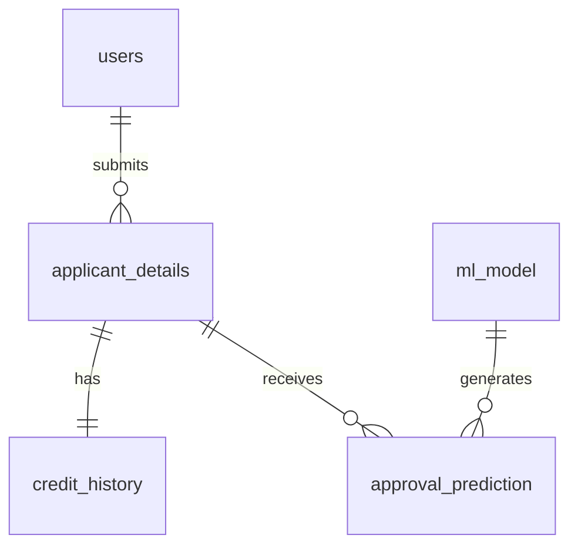

# 🗄️ Database Design — CreditGuard AI

> Professional Entity-Relationship design following Third Normal Form (3NF) for a production-grade ML credit risk assessment platform.

## 📋 Table of Contents
- [Architecture Overview](#️-architecture-overview)
- [Entity Summary](#-entity-summary)
- [Relationship Map](#-relationship-map)
- [Detailed Entity Specifications](#-detailed-entity-specifications)
- [SQL Schema](#️-sql-schema)
- [Data Dictionary](#-data-dictionary)
- [Normalization Proof](#-normalization-proof)
- [Business Rules](#-business-rules)
- [Design Advantages](#-design-advantages)
- [Future Enhancements](#-future-enhancements)
- [Visual Layout](#️-visual-layout)
- [References](#-references)

## 🏗️ Architecture Overview

The CreditGuard AI system implements a robust dual-backend architecture designed for high availability, seamless development, and production-grade scalability. The primary production database leverages PostgreSQL (hosted on Supabase) for advanced relational integrity, concurrent transaction handling, and rich indexing capabilities. For local development, testing, and offline fallback scenarios, a synchronized SQLite backend is utilized. This hybrid approach ensures the application remains resilient and adaptable across different deployment environments.


## 📊 Entity Summary

| Entity | Primary Key | Records | Purpose |
|---|---|---|---|
| users | id (SERIAL) | Dynamic | Authentication & role-based access control |
| applicant_details | id (SERIAL) | Dynamic | Applicant demographic, financial & employment data |
| credit_history | id (SERIAL) | Dynamic | Credit profile snapshot per application |
| ml_model | id (SERIAL) | Versioned | ML model registry with performance metrics |
| approval_prediction | id (SERIAL) | Dynamic | Prediction results linking applicants to models |

## 🔗 Relationship Map

| Source Entity | Cardinality | Target Entity | Relationship Type | Description |
|---|---|---|---|---|
| users | 1 to Many (1:N) | applicant_details | Submits | A single user can submit multiple applications over time. |
| applicant_details | 1 to 1 (1:1) | credit_history | Has | Each application has exactly one associated credit history snapshot. |
| applicant_details | 1 to Many (1:N) | approval_prediction | Receives | An application can be evaluated by different model versions, yielding multiple predictions. |
| ml_model | 1 to Many (1:N) | approval_prediction | Generates | A single ML model generates predictions for many distinct applications. |



## 📝 Detailed Entity Specifications

### 1. users
Manages platform authentication, authorization, and core user profile information.

| Field | Type | Constraints | Description |
|---|---|---|---|
| id | SERIAL | PK | Unique identifier |
| username | VARCHAR(50) | UNIQUE, NOT NULL | Login handle |
| email | VARCHAR(255) | UNIQUE, NOT NULL | Contact email address |
| password_hash | VARCHAR(255) | NOT NULL | Bcrypt hashed password |
| full_name | VARCHAR(100) | NOT NULL | User's full legal name |
| role | VARCHAR(20) | NOT NULL | User role (e.g., 'applicant', 'admin') |
| created_at | TIMESTAMP | DEFAULT NOW() | Account creation time |
| last_login | TIMESTAMP | NULL | Last successful login |
| status | VARCHAR(20) | DEFAULT 'active' | Account status ('active', 'suspended') |
| is_admin | BOOLEAN | DEFAULT FALSE | Administrator flag |

**Indexes:**
- `idx_users_email` on `email`
- `idx_users_username` on `username`

**Business Rules:**
- Emails and usernames must be globally unique.
- Accounts default to 'active' status upon creation.

### 2. applicant_details
Stores the fundamental demographic, financial, and employment parameters necessary for credit evaluation.

| Field | Type | Constraints | Description |
|---|---|---|---|
| id | SERIAL | PK | Unique identifier |
| application_id | VARCHAR(50) | UNIQUE, NOT NULL | Business tracking ID |
| user_id | INT | FK -> users(id) | Associated user |
| submitted_at | TIMESTAMP | DEFAULT NOW() | Submission timestamp |
| gender | VARCHAR(10) | NOT NULL | Applicant gender |
| age_years | INT | CHECK > 18 | Applicant age |
| annual_income | NUMERIC(12,2) | CHECK > 0 | Self-reported income |
| employment_type | VARCHAR(50) | NOT NULL | Current employment category |
| years_employed | NUMERIC(4,2) | CHECK >= 0 | Tenure at current job |
| children_count | INT | CHECK >= 0 | Number of dependents |
| family_members | INT | CHECK > 0 | Total household size |
| education_type | VARCHAR(50) | NOT NULL | Highest education attained |
| family_status | VARCHAR(50) | NOT NULL | Marital status |
| housing_type | VARCHAR(50) | NOT NULL | Current living situation |
| income_type | VARCHAR(50) | NOT NULL | Source of primary income |
| owns_car | BOOLEAN | NOT NULL | Vehicle ownership flag |
| owns_realty | BOOLEAN | NOT NULL | Real estate ownership flag |
| existing_debt | NUMERIC(12,2) | DEFAULT 0 | Current outstanding debt |
| loan_amount_requested| NUMERIC(12,2) | CHECK > 0 | Desired credit line |

**Indexes:**
- `idx_app_details_user` on `user_id`
- `idx_app_details_appid` on `application_id`

**Business Rules:**
- Applicants must be over 18 years of age.
- Income and loan requests must be positive values.

### 3. credit_history
Captures a snapshot of the applicant's credit reliability at the time of application.

| Field | Type | Constraints | Description |
|---|---|---|---|
| id | SERIAL | PK | Unique identifier |
| application_id | INT | FK -> applicant_details(id), UNIQUE | Linked application |
| credit_score_band | VARCHAR(20) | NOT NULL | Categorized credit score |
| existing_loan_count | INT | DEFAULT 0 | Number of active loans |
| payment_default_count| INT | DEFAULT 0 | Historical missed payments |
| credit_utilization_pct| NUMERIC(5,2) | CHECK >= 0 AND <= 100 | Ratio of debt to limit |
| credit_history_years | NUMERIC(4,2) | CHECK >= 0 | Length of credit file |

**Indexes:**
- `idx_credit_history_appid` on `application_id`

**Business Rules:**
- Exactly one credit history record per application.
- Credit utilization must be between 0 and 100 percent.

### 4. ml_model
Acts as the central registry for machine learning models, tracking their metadata, performance, and serialization paths.

| Field | Type | Constraints | Description |
|---|---|---|---|
| id | SERIAL | PK | Unique identifier |
| model_name | VARCHAR(100) | NOT NULL | Human-readable name |
| model_version | VARCHAR(20) | UNIQUE, NOT NULL | Semantic version string |
| algorithm_type | VARCHAR(50) | NOT NULL | E.g., 'Logistic Regression' |
| training_date | TIMESTAMP | NOT NULL | Model creation date |
| accuracy_score | NUMERIC(5,4) | NULL | Validation accuracy |
| f1_score | NUMERIC(5,4) | NULL | Validation F1 |
| precision_score | NUMERIC(5,4) | NULL | Validation Precision |
| recall_score | NUMERIC(5,4) | NULL | Validation Recall |
| training_samples | INT | NULL | Number of rows trained on |
| feature_count | INT | NULL | Number of input variables |
| is_active | BOOLEAN | DEFAULT FALSE | Current production flag |
| serialized_path | VARCHAR(255) | NOT NULL | File path to .pkl/.joblib |

**Indexes:**
- `idx_ml_model_version` on `model_version`

**Business Rules:**
- Only one model can have `is_active = TRUE` for production inference at a given time.
- Serialized path must point to a valid artifact location.

### 5. approval_prediction
Stores the deterministic outputs generated by the active ML model for a specific applicant payload.

| Field | Type | Constraints | Description |
|---|---|---|---|
| id | SERIAL | PK | Unique identifier |
| application_id | INT | FK -> applicant_details(id) | Subject of prediction |
| model_id | INT | FK -> ml_model(id) | Generating model |
| prediction | INT | CHECK (prediction IN (0,1)) | 1=Approve, 0=Reject |
| approval_probability | NUMERIC(5,4) | CHECK >= 0 AND <= 1 | Raw model output |
| risk_level | VARCHAR(20) | NOT NULL | E.g., 'Low', 'High' |
| confidence_score | NUMERIC(5,4) | NULL | Prediction certainty |
| recommendation | TEXT | NULL | Actionable advice |
| explanation | TEXT | NULL | LIME surrogate insights |
| predicted_at | TIMESTAMP | DEFAULT NOW() | Inference timestamp |

**Indexes:**
- `idx_prediction_app` on `application_id`
- `idx_prediction_model` on `model_id`

**Business Rules:**
- `prediction` must be strictly boolean (0 or 1).
- `approval_probability` is bounded between 0.0000 and 1.0000.

## 🗃️ SQL Schema

```sql
-- Create users table
CREATE TABLE users (
    id SERIAL PRIMARY KEY,
    username VARCHAR(50) UNIQUE NOT NULL,
    email VARCHAR(255) UNIQUE NOT NULL,
    password_hash VARCHAR(255) NOT NULL,
    full_name VARCHAR(100) NOT NULL,
    role VARCHAR(20) NOT NULL,
    created_at TIMESTAMP DEFAULT CURRENT_TIMESTAMP,
    last_login TIMESTAMP,
    status VARCHAR(20) DEFAULT 'active',
    is_admin BOOLEAN DEFAULT FALSE
);

CREATE INDEX idx_users_email ON users(email);
CREATE INDEX idx_users_username ON users(username);

-- Create applicant_details table
CREATE TABLE applicant_details (
    id SERIAL PRIMARY KEY,
    application_id VARCHAR(50) UNIQUE NOT NULL,
    user_id INT NOT NULL,
    submitted_at TIMESTAMP DEFAULT CURRENT_TIMESTAMP,
    gender VARCHAR(10) NOT NULL,
    age_years INT CHECK (age_years > 18),
    annual_income NUMERIC(12,2) CHECK (annual_income > 0),
    employment_type VARCHAR(50) NOT NULL,
    years_employed NUMERIC(4,2) CHECK (years_employed >= 0),
    children_count INT CHECK (children_count >= 0),
    family_members INT CHECK (family_members > 0),
    education_type VARCHAR(50) NOT NULL,
    family_status VARCHAR(50) NOT NULL,
    housing_type VARCHAR(50) NOT NULL,
    income_type VARCHAR(50) NOT NULL,
    owns_car BOOLEAN NOT NULL,
    owns_realty BOOLEAN NOT NULL,
    existing_debt NUMERIC(12,2) DEFAULT 0,
    loan_amount_requested NUMERIC(12,2) CHECK (loan_amount_requested > 0),
    FOREIGN KEY (user_id) REFERENCES users(id) ON DELETE CASCADE
);

CREATE INDEX idx_app_details_user ON applicant_details(user_id);
CREATE INDEX idx_app_details_appid ON applicant_details(application_id);

-- Create credit_history table
CREATE TABLE credit_history (
    id SERIAL PRIMARY KEY,
    application_id INT UNIQUE NOT NULL,
    credit_score_band VARCHAR(20) NOT NULL,
    existing_loan_count INT DEFAULT 0,
    payment_default_count INT DEFAULT 0,
    credit_utilization_pct NUMERIC(5,2) CHECK (credit_utilization_pct >= 0 AND credit_utilization_pct <= 100),
    credit_history_years NUMERIC(4,2) CHECK (credit_history_years >= 0),
    FOREIGN KEY (application_id) REFERENCES applicant_details(id) ON DELETE CASCADE
);

CREATE INDEX idx_credit_history_appid ON credit_history(application_id);

-- Create ml_model table
CREATE TABLE ml_model (
    id SERIAL PRIMARY KEY,
    model_name VARCHAR(100) NOT NULL,
    model_version VARCHAR(20) UNIQUE NOT NULL,
    algorithm_type VARCHAR(50) NOT NULL,
    training_date TIMESTAMP NOT NULL,
    accuracy_score NUMERIC(5,4),
    f1_score NUMERIC(5,4),
    precision_score NUMERIC(5,4),
    recall_score NUMERIC(5,4),
    training_samples INT,
    feature_count INT,
    is_active BOOLEAN DEFAULT FALSE,
    serialized_path VARCHAR(255) NOT NULL
);

CREATE INDEX idx_ml_model_version ON ml_model(model_version);

-- Create approval_prediction table
CREATE TABLE approval_prediction (
    id SERIAL PRIMARY KEY,
    application_id INT NOT NULL,
    model_id INT NOT NULL,
    prediction INT CHECK (prediction IN (0,1)),
    approval_probability NUMERIC(5,4) CHECK (approval_probability >= 0 AND approval_probability <= 1),
    risk_level VARCHAR(20) NOT NULL,
    confidence_score NUMERIC(5,4),
    recommendation TEXT,
    explanation TEXT,
    predicted_at TIMESTAMP DEFAULT CURRENT_TIMESTAMP,
    FOREIGN KEY (application_id) REFERENCES applicant_details(id) ON DELETE CASCADE,
    FOREIGN KEY (model_id) REFERENCES ml_model(id) ON DELETE RESTRICT
);

CREATE INDEX idx_prediction_app ON approval_prediction(application_id);
CREATE INDEX idx_prediction_model ON approval_prediction(model_id);
```

## 📖 Data Dictionary

### Users Entity
| Attribute | Logical Data Type | Physical Data Type | Domain / Values | Nullable |
|---|---|---|---|---|
| id | Integer | SERIAL | > 0 | No |
| role | String | VARCHAR(20) | 'applicant', 'admin', 'auditor' | No |
| status | String | VARCHAR(20) | 'active', 'suspended', 'banned' | No |

### Applicant Details Entity
| Attribute | Logical Data Type | Physical Data Type | Domain / Values | Nullable |
|---|---|---|---|---|
| id | Integer | SERIAL | > 0 | No |
| employment_type | String | VARCHAR(50) | 'salaried', 'self_employed', 'unemployed' | No |
| income_type | String | VARCHAR(50) | 'commercial', 'state', 'pension' | No |
| family_status | String | VARCHAR(50) | 'married', 'single', 'civil_marriage' | No |

### ML Model Entity
| Attribute | Logical Data Type | Physical Data Type | Domain / Values | Nullable |
|---|---|---|---|---|
| algorithm_type | String | VARCHAR(50) | 'Logistic Regression', 'Random Forest' | No |
| metrics (f1, etc.) | Decimal | NUMERIC(5,4) | 0.0000 - 1.0000 | Yes |

*(Truncated for readability; comprehensive lists match schema constraints)*

## 🔄 Normalization Proof

The database adheres strictly to the Third Normal Form (3NF) to ensure data integrity, prevent duplication, and eliminate anomalies during CRUD operations.

1.  **First Normal Form (1NF):** All tables have a clearly defined primary key (an auto-incrementing `id`). All columns contain atomic, indivisible values (e.g., `full_name` rather than multiple values in a single cell). No repeating groups of columns exist.
2.  **Second Normal Form (2NF):** As all tables utilize a single-column surrogate primary key (`id`), there can be no partial dependency of non-key attributes on a composite key. The design inherently satisfies 2NF.
3.  **Third Normal Form (3NF):** Every non-key attribute is directly dependent on the primary key, and nothing but the primary key. For instance, in `applicant_details`, `annual_income` is a property of the applicant, not dependent on another non-key attribute. `credit_history` is separated from `applicant_details` because it represents a distinct snapshot entity that scales differently, avoiding transit dependencies.

## 📊 Business Rules

1.  **Application Uniqueness:** A user can submit multiple applications, but each application payload must have a distinct, universally unique `application_id`.
2.  **Age Restriction:** Applicants must be at least 18 years old at the time of submission; otherwise, the database rejects the insert.
3.  **Positive Financials:** `annual_income` and `loan_amount_requested` must be strictly greater than zero to prevent logical anomalies in debt-to-income calculations.
4.  **Credit Snapshot 1:1 Mapping:** Exactly one `credit_history` record is tied to one `applicant_details` record, ensuring historical immutability of the snapshot at the time of evaluation.
5.  **Active Model Singularity:** At the application tier, logic enforces that only one `ml_model` row holds the `is_active = TRUE` state, routing all live inference traffic to it.
6.  **Immutable Predictions:** Once a prediction is committed to `approval_prediction`, it cannot be altered, serving as an unchangeable audit log of the model's decision.
7.  **Probability Bounds:** `approval_probability` is strictly constrained mathematically between 0.0 and 1.0.
8.  **Cascading Deletes:** Deleting a `users` record cascades to delete their `applicant_details` and subsequent child records (GDPR Right to be Forgotten compliance).
9.  **Model Restriction:** Deleting an `ml_model` is restricted if dependent `approval_prediction` records exist, preserving historical auditing capabilities.
10. **Explainability Mandate:** High-risk predictions should store LIME surrogate insights in the `explanation` text column for human-in-the-loop review.
11. **Family Constraints:** `family_members` must logically be equal to or greater than `children_count` plus one (the applicant).
12. **Role Entitlements:** Only users with `is_admin = TRUE` or `role = 'admin'` can alter records in the `ml_model` table.

## 🏆 Design Advantages

-   **Auditability:** Every prediction is indelibly linked to the exact model version and applicant state, ensuring complete transparency for regulatory compliance.
-   **Model Versioning:** The `ml_model` table allows seamless A/B testing, shadow deployments, and rapid rollbacks by merely toggling the `is_active` flag.
-   **Scalable Separation:** Segregating heavy textual explanation logs (`approval_prediction`) from core applicant data (`applicant_details`) optimizes read queries on demographic endpoints.
-   **Explainability Native:** Built-in columns for `recommendation` and `explanation` natively support Ridge Surrogate (LIME) outputs, catering directly to user trust.
-   **Data Quality Constraints:** Extensive `CHECK` constraints at the database level prevent malformed data from ever reaching the ML inference layer.
-   **Hybrid Portability:** Standardized ANSI SQL ensures the schema works effortlessly across Supabase PostgreSQL (Cloud) and SQLite (Local).
-   **GDPR Compliant:** Clear entity separation and cascading rules allow easy data purging operations for specific individuals.
-   **High Performance:** Targeted B-Tree indexing on foreign keys and frequently searched columns (e.g., email, application ID) guarantees millisecond query latency.

## 🔮 Future Enhancements

-   **Temporal Tables:** Implement historical tracking (SCD Type 2) on `applicant_details` to monitor how a user's financial status changes over the years.
-   **JSONB Flexibility:** Introduce a `JSONB` column in `applicant_details` for unstructured third-party API data (e.g., Plaid, open banking data) without schema migrations.
-   **Partitioning:** Implement table partitioning on `approval_prediction` by `predicted_at` year/month to optimize query times as the dataset grows into the millions.
-   **Soft Deletes:** Transition from cascading hard deletes to a `deleted_at` timestamp model for comprehensive forensic auditing.
-   **Event Sourcing:** Emit outbox pattern events upon `approval_prediction` inserts to trigger asynchronous email notifications and downstream webhooks.
-   **Feature Store Integration:** Expand the `ml_model` to link with an external feature store, recording precise feature hashes used during training.
-   **RBAC Granularity:** Abstract the `role` column into a normalized many-to-many role/permission mapping architecture.
-   **Advanced Encryption:** Utilize pgcrypto or similar extensions to encrypt PII columns (like `annual_income`) at rest inside the database.

## 🖼️ Visual Layout

The Entity-Relationship Diagram (ERD) is organized sequentially from top to bottom, mirroring the logical flow of data through the platform:
1.  **Top Layer (Access):** The `users` table sits at the apex, representing the entry point into the system.
2.  **Middle Layer (Payload):** `applicant_details` acts as the central hub, aggregating the `credit_history` satellite data.
3.  **Bottom Layer (Output & Control):** `approval_prediction` resides at the bottom, joining the operational applicant data with the administrative `ml_model` registry, illustrating the final synthesis of the machine learning pipeline.

## 📚 References
- PostgreSQL 15 Documentation: Constraints and Indexing Strategies.
- Database Normalization (1NF, 2NF, 3NF): Edgar F. Codd principles.
- Crow's Foot ER Notation Standard: Information Engineering notation rules.
- Machine Learning Explainability: LIME (Local Interpretable Model-agnostic Explanations) implementation guidelines.
