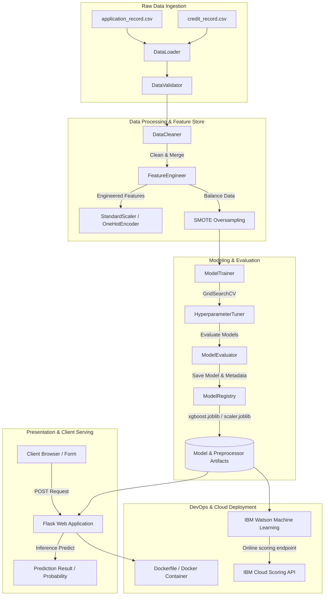

# System Architecture Diagram

The system follows a multi-tier modular architecture separating data ingestion, machine learning processing, web presentation, and cloud deployment layers.

```mermaid
graph TD
    subgraph Raw Data Ingestion
        A[application_record.csv] --> C[DataLoader]
        B[credit_record.csv] --> C
        C --> D[DataValidator]
    end

    subgraph Data Processing & Feature Store
        D --> E[DataCleaner]
        E -->|Clean & Merge| F[FeatureEngineer]
        F -->|Engineered Features| G[StandardScaler / OneHotEncoder]
        F -->|Balance Data| H[SMOTE Oversampling]
    end

    subgraph Modeling & Evaluation
        H --> I[ModelTrainer]
        I -->|GridSearchCV| J[HyperparameterTuner]
        J -->|Evaluate Models| K[ModelEvaluator]
        K -->|Save Model & Metadata| L[ModelRegistry]
        L -->|xgboost.joblib / scaler.joblib| M[(Model & Preprocessor Artifacts)]
    end

    subgraph Presentation & Client Serving
        M --> N[Flask Web Application]
        O[Client Browser / Form] -->|POST Request| N
        N -->|Inference Predict| P[Prediction Result / Probability]
    end

    subgraph DevOps & Cloud Deployment
        N --> Q[Dockerfile / Docker Container]
        M --> R[IBM Watson Machine Learning]
        R -->|Online scoring endpoint| S[IBM Cloud Scoring API]
    end
```
