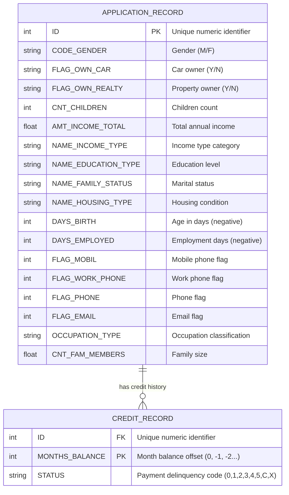

# Entity Relationship (ER) Diagram

The dataset maps the relationship between demographic application attributes and historical credit monthly repayment status via a shared unique ID.

```mermaid
erDiagram
    APPLICATION_RECORD {
        int ID PK "Unique numeric identifier"
        string CODE_GENDER "Gender (M/F)"
        string FLAG_OWN_CAR "Car owner (Y/N)"
        string FLAG_OWN_REALTY "Property owner (Y/N)"
        int CNT_CHILDREN "Children count"
        float AMT_INCOME_TOTAL "Total annual income"
        string NAME_INCOME_TYPE "Income type category"
        string NAME_EDUCATION_TYPE "Education level"
        string NAME_FAMILY_STATUS "Marital status"
        string NAME_HOUSING_TYPE "Housing condition"
        int DAYS_BIRTH "Age in days (negative)"
        int DAYS_EMPLOYED "Employment days (negative)"
        int FLAG_MOBIL "Mobile phone flag"
        int FLAG_WORK_PHONE "Work phone flag"
        int FLAG_PHONE "Phone flag"
        int FLAG_EMAIL "Email flag"
        string OCCUPATION_TYPE "Occupation classification"
        float CNT_FAM_MEMBERS "Family size"
    }

    CREDIT_RECORD {
        int ID FK "Unique numeric identifier"
        int MONTHS_BALANCE PK "Month balance offset (0, -1, -2...)"
        string STATUS "Payment delinquency code (0,1,2,3,4,5,C,X)"
    }

    APPLICATION_RECORD ||--o{ CREDIT_RECORD : "has credit history"
```
