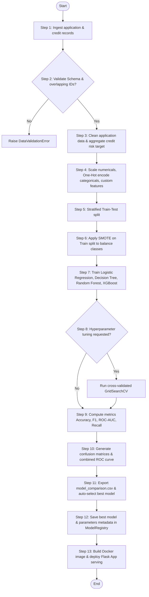

# Machine Learning Pipeline Flowchart

This flowchart visualizes the sequence of logical operations from raw ingestion to model deployment serving.

```mermaid
flowchart TD
    Start([Start]) --> Ingest[Step 1: Ingest application & credit records]
    Ingest --> Validate{Step 2: Validate Schema & overlapping IDs?}
    Validate -- No --> FailError[Raise DataValidationError]
    Validate -- Yes --> Clean[Step 3: Clean application data & aggregate credit risk target]
    Clean --> FeatEng[Step 4: Scale numericals, One-Hot encode categoricals, custom features]
    FeatEng --> Split[Step 5: Stratified Train-Test split]
    Split --> Smote[Step 6: Apply SMOTE on Train split to balance classes]
    Smote --> Train[Step 7: Train Logistic Regression, Decision Tree, Random Forest, XGBoost]
    Train --> Tune{Step 8: Hyperparameter tuning requested?}
    Tune -- Yes --> Grid[Run cross-validated GridSearchCV]
    Tune -- No --> Eval[Step 9: Compute metrics Accuracy, F1, ROC-AUC, Recall]
    Grid --> Eval
    Eval --> Plots[Step 10: Generate confusion matrices & combined ROC curve]
    Plots --> Compare[Step 11: Export model_comparison.csv & auto-select best model]
    Compare --> Registry[Step 12: Save best model & parameters metadata in ModelRegistry]
    Registry --> DockerServe[Step 13: Build Docker image & deploy Flask App serving]
    DockerServe --> End([End])
```
