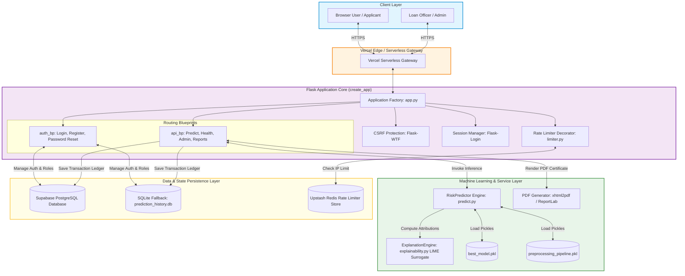

# 🌐 Flask Web Application & Deployment Guide — CreditGuard AI

> A comprehensive technical architecture document detailing the Flask web framework, REST API design, dual-backend database manager, security layer, UI template engine, model loading, and serverless deployment in **CreditGuard AI**.

---

## 📑 Table of Contents
- [Architecture Overview](#-architecture-overview)
- [System Architecture Diagram](#-system-architecture-diagram)
- [Application Factory & Blueprint Workflow](#-application-factory--blueprint-workflow)
- [Directory Structure](#-directory-structure)
- [HTML Templates & Glassmorphic UI System](#-html-templates--glassmorphic-ui-system)
- [Static Assets & Telemetry Scripts](#-static-assets--telemetry-scripts)
- [Model Loading & Pre-warming Strategy](#-model-loading--pre-warming-strategy)
- [End-to-End Prediction Pipeline](#-end-to-end-prediction-pipeline)
- [User Input Validation & Security Layer](#-user-input-validation--security-layer)
- [Prediction Output & PDF Generation](#-prediction-output--pdf-generation)
- [Error Handling & Fallback Mechanisms](#-error-handling--fallback-mechanisms)
- [Future System Enhancements](#-future-system-enhancements)

---

## 🏛️ Architecture Overview

The **CreditGuard AI** web application is built on **Flask 3.0** using the **Application Factory Pattern** (`create_app()`). It provides a secure, role-based web portal and REST API endpoints for automated credit risk assessment. 

### Key Architectural Pillars:
1. **Application Factory Pattern**: Decouples configuration, database initialization, and routing blueprints, allowing clean instantiation for development, testing (`pytest`), and production environments.
2. **Dual-Backend Database Manager (`DatabaseManager`)**: Operates seamlessly across two database backends:
   - **PostgreSQL (Supabase)**: Primary production database (`SUPABASE_DB_URL`) accessed via `psycopg2-binary`.
   - **SQLite3**: Offline local fallback (`prediction_history.db`) automatically activated when cloud environment variables are absent.
3. **Hybrid Distributed Rate Limiter (`rate_limit`)**: IP-based rate limiting connecting to **Upstash Redis** (`REDIS_URL`) in cloud deployments with automatic fallback to an in-memory dictionary.
4. **Role-Based Access Control (RBAC)**: Enforced via `Flask-Login` and `Werkzeug` scrypt password hashing across three roles: `Admin`, `Loan Officer`, and `User`.
5. **Serverless Optimized Architecture**: Engineered for Vercel serverless hosting with read-only filesystem compliance (write redirection to `/tmp`).

---

## 📊 System Architecture Diagram



---

## ⚡ Application Factory & Blueprint Workflow

The application entry point resides in `app/app.py`:

```python
def create_app() -> Flask:
    app = Flask(__name__, template_folder="templates", static_folder="static")
    
    # Configure environment
    env = os.getenv("FLASK_ENV", "development")
    app.config.from_object(get_config(env))
    
    # Extensions
    csrf = CSRFProtect(app)
    login_manager.init_app(app)
    
    # Register Blueprints
    app.register_blueprint(api_bp)   # Main routes (/predict, /health, /admin, /report)
    app.register_blueprint(auth_bp)  # Auth routes (/auth/login, /auth/register)
    
    # Pre-load ML Model into memory during container startup
    _predictor.load_pipeline()
    _predictor.load_model()
    
    return app
```

---

## 📂 Directory Structure

```
5_Project_Development_Phase/app/
├── app.py                          # Flask application factory (create_app)
├── database/
│   ├── database.py                 # Dual DatabaseManager (Postgres/SQLite)
│   └── history.py                  # Transaction logging & ledger queries
├── models/
│   └── user.py                     # Flask-Login User model & RBAC helper
├── routes/
│   ├── auth.py                     # Authentication blueprint (/auth/*)
│   ├── forms.py                    # Flask-WTF form definitions
│   ├── routes.py                   # Main API blueprint (/predict, /admin, /report)
│   └── validators.py               # Input validation handlers
├── services/
│   ├── predict.py                  # RiskPredictor inference engine
│   ├── prediction.py               # External REST API wrapper
│   └── explainability.py           # Ridge Surrogate (LIME-inspired) explainer
├── static/
│   ├── css/                        # Custom Glassmorphic CSS design system
│   └── js/                         # Chart.js telemetry & multi-step wizard logic
├── templates/                      # Jinja2 HTML templates
│   ├── 404.html                    # Not Found error template
│   ├── 500.html                    # Internal Server Error template
│   ├── admin.html                  # Operations Analytics Dashboard
│   ├── base.html                   # Master layout template
│   ├── history.html                # Prediction history ledger
│   ├── index.html                  # Public landing portal
│   ├── login.html                  # Authentication login page
│   ├── predict.html                # 4-Step Credit Wizard Form
│   ├── profile.html                # User profile & telemetry
│   ├── register.html               # New user registration page
│   └── result.html                 # Scorecard dashboard & LIME gauge
└── utils/
    ├── email.py                    # Password reset email handler
    ├── exceptions.py               # Custom exception hierarchy
    ├── helper.py                   # JSON/Pickle helpers
    ├── limiter.py                  # Redis-backed rate limiter decorator
    └── logger.py                   # Structured logger
```

---

## 🎨 HTML Templates & Glassmorphic UI System

The front-end interface uses a custom **Glassmorphism Dark Futuristic** design system built with HTML5 and Vanilla CSS3.

### Key Template Components:
- **`base.html`**: Master layout containing dark-mode design tokens, navigation headers, flash alert banners, and global CSS/JS dependencies.
- **`index.html`**: Landing portal featuring system badges, live demo status metrics, and platform features.
- **`predict.html`**: Interactive **4-Step Credit Wizard Form**:
  - *Step 1*: Personal & Demographic Info (Gender, Age, Family Members, Children).
  - *Step 2*: Income & Employment (Income Total, Income Source, Employment Type, Years Employed).
  - *Step 3*: Housing & Assets (Housing Type, Car Ownership, Property Ownership).
  - *Step 4*: Credit Obligations & Debt (Existing Debt, Requested Loan Amount, Credit Score Band).
- **`result.html`**: Decision Scorecard rendering the final decision badge (`Approved` vs `Rejected`), approval probability percentage gauge, top 5 positive/negative risk factor attributions, and a one-click PDF download trigger.
- **`admin.html`**: Operations Analytics Console rendering real-time Chart.js graphs (approval ratios, family status densities, monthly trends).
- **`history.html`**: Filterable, sortable prediction transaction ledger.

---

## 📊 Static Assets & Telemetry Scripts

- **CSS Design System** (`static/css/`): Contains custom glassmorphism styles (`backdrop-filter: blur(12px)`), dark background gradients (`#0a0e17`), responsive grid layouts, and color-coded status badges.
- **JavaScript Telemetry** (`static/js/`):
  - **Chart.js Integration**: Renders interactive pie charts for approval splits and bar charts for income risk distributions on `/admin`.
  - **Wizard Navigation Logic**: Controls dynamic step transitions, client-side input validation before advancing steps, and smooth progress bar animations.

---

## 🚀 Model Loading & Pre-warming Strategy

To guarantee sub-10ms inference and avoid latency spikes on the first user request, **CreditGuard AI** implements a **Container Pre-warming Strategy** inside `app/services/predict.py`:

```python
class RiskPredictor:
    def __init__(self):
        paths = config.get_paths()
        self.pipeline_path = os.path.join(paths["models_dir"], "preprocessing_pipeline.pkl")
        self.model_path = os.path.join(paths["models_dir"], "best_model.pkl")
        self.pipeline = None
        self.model = None

    def load_pipeline(self):
        if self.pipeline is None:
            self.pipeline = load_pkl(self.pipeline_path)
        return self.pipeline

    def load_model(self):
        if self.model is None:
            self.model = load_pkl(self.model_path)
        return self.model
```

During Flask application initialization (`create_app()`), `_predictor.load_pipeline()` and `_predictor.load_model()` are called explicitly, loading the binary pickles into memory once during WSGI server boot.

---

## 🔄 End-to-End Prediction Pipeline

```
HTTP POST /predict ──> CSRF Check ──> InputValidator ──> RiskPredictor.predict()
                                                             │
                                                             ▼
PDF Report <── Scorecard UI <── ExplanationEngine <── Pipeline.transform()
```

1. **Request Ingestion**: User submits form data via `POST /predict`.
2. **CSRF & Auth Verification**: `Flask-WTF` validates the CSRF token; `Flask-Login` verifies user authentication context.
3. **Input Validation**: `InputValidator` checks schema compliance, data types, and numerical ranges.
4. **Pipeline Transformation**: `preprocessing_pipeline.pkl` transforms raw input attributes into scaled, one-hot encoded feature vector $X_{\text{trans}}$.
5. **Model Inference**: `best_model.pkl` (`LogisticRegression`) executes `predict_proba(X_trans)` to compute default probability $p_{\text{default}}$. Approval probability is derived as:
   $$\text{Approval Probability \%} = (1.0 - p_{\text{default}}) \times 100.0$$
6. **Local Explainability**: `ExplanationEngine` computes log-odds feature attributions (or fits a local Ridge surrogate for tree models), extracting top risk factors.
7. **Ledger Commit**: Transaction details (Application ID `APP-XXXXXX`, timestamp, inputs, outputs, risk level) are committed to PostgreSQL/SQLite.
8. **Response Rendering**: Returns `result.html` with decision scorecards and PDF download triggers.

---

## 🔒 User Input Validation & Security Layer

- **Form Validation (`WTForms` & `InputValidator`)**: Ensures numerical values fall within realistic economic bounds (e.g., `amt_income_total > 0`, `age_years` between 18 and 100).
- **CSRF Protection**: All POST endpoints require valid `csrf_token` headers generated by `Flask-WTF`.
- **Password Security**: Passwords are hashed using Werkzeug's **`scrypt`** algorithm (`scrypt:32768:8:1$`). Raw passwords are never logged or stored.
- **Distributed Rate Limiter (`@rate_limit`)**: Limits requests per client IP to prevent brute-force attacks on `/auth/login` and `/auth/forgot-password`. Uses Upstash Redis in cloud deployments and falls back gracefully to local memory.

---

## 📄 Prediction Output & PDF Generation

In addition to interactive web dashboards, CreditGuard AI generates official, server-side compiled PDF certificates via `xhtml2pdf` (powered by `ReportLab`):

```python
# Triggered via GET /report/<application_id>?format=pdf
@api_bp.route("/report/<application_id>", methods=["GET"])
@login_required
def generate_report(application_id):
    ...
    if request.args.get("format") == "pdf":
        html_content = render_template("report_pdf.html", record=record)
        result = BytesIO()
        pisa.CreatePDF(html_content, dest=result)
        result.seek(0)
        return Response(result.getvalue(), mimetype="application/pdf",
                        headers={"Content-Disposition": f"attachment; filename=report_{application_id}.pdf"})
```

The PDF contains applicant information, decision scorecards, risk level gauges, LIME explanations, and verification QR codes.

---

## 🛡️ Error Handling & Fallback Mechanisms

- **Custom Error Routes**: Handles `404 Not Found` and `500 Internal Server Error` using custom themed templates (`404.html`, `500.html`).
- **Database Fallback**: If `SUPABASE_DB_URL` becomes unreachable or fails to connect, `DatabaseManager` automatically logs a warning and routes queries to local SQLite (`prediction_history.db`).
- **Rate Limiting Fallback**: If Upstash Redis connection times out (`socket_timeout=3`), `limiter.py` catches the exception and falls back to local in-memory IP tracking.

---

## 🔮 Future System Enhancements

1. **SHAP Integration**: Migrate local surrogate models to tree-native SHAP (SHapley Additive exPlanations) for exact game-theoretic feature attributions.
2. **Real-time Webhook Alerts**: Send Slack or Email notifications to loan officers when high-risk overrides are requested.
3. **Automated Data Drift Monitoring**: Monitor input variance distributions over time to detect covariate shift.
4. **Fairness & Bias Audits**: Integrate AIF360 frameworks to audit credit scoring metrics across protected demographic attributes.

---
*Documentation compiled for GitHub Repository Documentation & SkillWallet Evaluation.*
