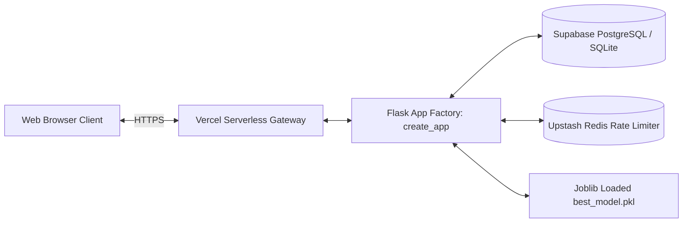
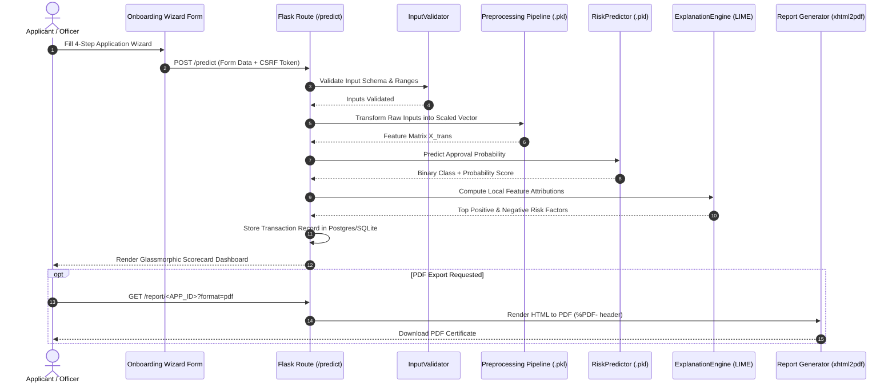

# 🔄 Project Flow & Lifecycle — CreditGuard AI (Credit Card Approval Prediction)

> A comprehensive, end-to-end architecture and execution lifecycle guide for the **Credit Card Approval Prediction** platform. This document maps out data ingestion, preprocessing, SMOTE resampling, multi-model evaluation, hyperparameter tuning, model serialization, Flask application serving, and real-time user prediction workflows.

---

## 📑 Table of Contents
- [End-to-End Workflow Diagram](#-end-to-end-workflow-diagram)
- [Step-by-Step Project Lifecycle](#-step-by-step-project-lifecycle)
- [Phase 1: Data Collection & Ingestion](#-phase-1-data-collection--ingestion)
- [Phase 2: Data Cleaning & Sanitization](#-phase-2-data-cleaning--sanitization)
- [Phase 3: Exploratory Data Analysis (EDA)](#-phase-3-exploratory-data-analysis-eda)
- [Phase 4: Feature Engineering](#-phase-4-feature-engineering)
- [Phase 5: Data Encoding & Standardization](#-phase-5-data-encoding--standardization)
- [Phase 6: Feature Scaling & Pipeline Construction](#-phase-6-feature-scaling--pipeline-construction)
- [Phase 7: Train-Test Stratified Split](#-phase-7-train-test-stratified-split)
- [Phase 8: Resampling & Model Training](#-phase-8-resampling--model-training)
- [Phase 9: Hyperparameter Tuning & Cross-Validation](#-phase-9-hyperparameter-tuning--cross-validation)
- [Phase 10: Model Comparison & Ranking](#-phase-10-model-comparison--ranking)
- [Phase 11: Best Model Selection & Serialization](#-phase-11-best-model-selection--serialization)
- [Phase 12: Production Flask Web Deployment](#-phase-12-production-flask-web-deployment)
- [Phase 13: User Prediction & Explainability Workflow](#-phase-13-user-prediction--explainability-workflow)

---

## 📊 End-to-End Workflow Diagram

```mermaid
flowchart TD
    %% Node Definitions
    subgraph Data_Ingestion ["1. Data Ingestion & Collection"]
        A1[Kaggle Dataset: application_record.csv]
        A2[Kaggle Dataset: credit_record.csv]
        A1 & A2 --> B1[DataLoader Module: Merge on ID]
    end

    subgraph Data_Preprocessing ["2. Data Cleaning & Validation"]
        B1 --> C1[DuplicateHandler: Remove Duplicate IDs]
        C1 --> C2[MissingValueImputer: Impute Occupation & Income]
        C2 --> C3[OutlierCapper: Capping Extreme Values via IQR]
    end

    subgraph Feature_Engineering ["3. Feature Engineering & Scaling"]
        C3 --> D1[FeatureEngineer: Age Years, Years Employed, Ratios]
        D1 --> D2[CategoricalEncoder: OneHot & Ordinal Encoding]
        D2 --> D3[NumericalScaler: StandardScaler Transformation]
        D3 --> D4[PreprocessingPipeline: Export preprocessing_pipeline.pkl]
    end

    subgraph Train_Test_Split ["4. Stratified Data Splitting"]
        D4 --> E1[StratifiedKFold & Split: 80% Train / 20% Test]
        E1 --> E2[(X_train, y_train)]
        E1 --> E3[(X_test, y_test)]
    end

    subgraph Model_Pipeline ["5. Training & Resampling"]
        E2 --> F1[SMOTE Oversampling: Balance Minority Default Class]
        F1 --> F2[ModelTrainer: Fit Baseline Models]
        F2 -->|Logistic Regression| G1[Candidate 1]
        F2 -->|Decision Tree| G2[Candidate 2]
        F2 -->|Random Forest| G3[Candidate 3]
        F2 -->|XGBoost| G4[Candidate 4]
    end

    subgraph Tuning_Evaluation ["6. Tuning & Comparison"]
        G1 & G2 & G3 & G4 --> H1[HyperparameterTuner: GridSearchCV 5-Fold CV]
        H1 --> H2[ModelEvaluator: Compute F1, ROC-AUC, Precision, Recall]
        H2 --> H3[ModelComparator: Rank Candidates by Minority F1-Score]
    end

    subgraph Serialization ["7. Selection & Model Saving"]
        H3 --> I1[Auto-Select Best Model: Logistic Regression]
        I1 --> I2[Joblib Serialization: Export best_model.pkl & Metrics JSON]
    end

    subgraph Web_Deployment ["8. Production Flask Web Application"]
        I2 & D4 --> J1[Flask App Factory: create_app]
        J1 --> J2[Dual DB Engine: Supabase Postgres / SQLite Fallback]
        J1 --> J3[Rate Limiter: Upstash Redis / Memory Fallback]
        J1 --> J4[Auth & RBAC: Flask-Login & Werkzeug scrypt]
    end

    subgraph User_Workflow ["9. User Prediction & Explainability"]
        K1[User Submits Form] --> J1
        J1 --> L1[Input Validation: InputValidator]
        L1 --> L2[Pipeline Transform: preprocessing_pipeline.pkl]
        L2 --> L3[Model Inference: best_model.pkl]
        L3 --> L4[ExplanationEngine: Local Ridge Surrogate / LIME Attribution]
        L4 --> M1[Generate Decision Dashboard: Approved / Rejected]
        M1 --> M2[Server-Side PDF Report: xhtml2pdf / ReportLab]
    end

    %% Styles
    style Data_Ingestion fill:#e1f5fe,stroke:#0288d1,stroke-width:2px;
    style Data_Preprocessing fill:#fff3e0,stroke:#f57c00,stroke-width:2px;
    style Feature_Engineering fill:#f3e5f5,stroke:#7b1fa2,stroke-width:2px;
    style Train_Test_Split fill:#e8f5e9,stroke:#388e3c,stroke-width:2px;
    style Model_Pipeline fill:#fffde7,stroke:#fbc02d,stroke-width:2px;
    style Tuning_Evaluation fill:#efebe9,stroke:#5d4037,stroke-width:2px;
    style Serialization fill:#e0f2f1,stroke:#00796b,stroke-width:2px;
    style Web_Deployment fill:#e8eaf6,stroke:#303f9f,stroke-width:2px;
    style User_Workflow fill:#fce4ec,stroke:#c2185b,stroke-width:2px;
```

---

## 🔄 Step-by-Step Project Lifecycle

The lifecycle of **CreditGuard AI** follows a 13-stage architecture designed for strict reproducibility, zero data leakage, high explainability, and production stability.

---

### 📥 Phase 1: Data Collection & Ingestion
- **Data Source**: Kaggle Credit Card Approval Prediction dataset (`application_record.csv` and `credit_record.csv`).
- **Ingestion Module**: `src/data/load_data.py` (`DataLoader`).
- **Process**:
  1. `application_record.csv` contains demographic, financial, housing, and employment attributes indexed by unique applicant ID (`ID`).
  2. `credit_record.csv` contains monthly payment status records (`STATUS`) spanning historical months.
  3. The `DataLoader` calculates the target variable (`STATUS_TARGET`) by checking if an applicant has defaults $\ge 60$ days overdue (`STATUS` values 2, 3, 4, 5).
  4. Merges demographic attributes with target labels on `ID`, producing a unified dataset.

---

### 🧹 Phase 2: Data Cleaning & Sanitization
- **Module**: `src/preprocessing/duplicates.py`, `missing_values.py`, and `outliers.py`.
- **Process**:
  1. **Duplicate Resolution**: `DuplicateHandler` identifies and removes redundant applicant `ID` entries to avoid data duplication.
  2. **Missing Value Imputation**: `MissingValueImputer` handles missing categorical values (e.g., `OCCUPATION_TYPE` imputed with `"Unknown"`) and missing numeric attributes using median strategy.
  3. **Outlier Capping**: `OutlierCapper` caps extreme continuous variables (e.g., `amt_income_total`, `DAYS_EMPLOYED`) using Interquartile Range (IQR) bounds ($1.5 \times \text{IQR}$) to prevent skewness without data loss.

---

### 📊 Phase 3: Exploratory Data Analysis (EDA)
- **Module**: `src/visualization/plots.py` (`VizPlotter`) and `src/visualization/eda.py`.
- **Outputs**: Generated and saved in `screenshots/eda/`.
- **Visual Audits**:
  - **Univariate Analysis**: Histograms with Kernel Density Estimation (KDE) overlays for `amt_income_total` and `age_years`.
  - **Bivariate Analysis**: Grouped count plots comparing `name_education_type` and `name_family_status` against the target class (`Approved` vs `Rejected`).
  - **Correlation Heatmaps**: Matrix heatmaps quantifying colinearity between numeric features.
  - **Target Imbalance Audit**: Class balance count plot highlighting the severe minority class distribution (~11% default rate).

---

### ⚙️ Phase 4: Feature Engineering
- **Module**: `src/features/feature_engineering.py` (`FeatureEngineer`).
- **Derived Features**:
  1. `age_years`: Transformed from negative `DAYS_BIRTH` ($\text{DAYS\_BIRTH} / -365.25$).
  2. `years_employed`: Transformed from negative `DAYS_EMPLOYED` ($\text{DAYS\_EMPLOYED} / -365.25$). Negative values (unemployed pensioners) mapped to `0`.
  3. `flag_unemployed`: Binary indicator flagging applicants without active employment.
  4. `income_per_family_member`: Ratio of `amt_income_total` to `cnt_fam_members`.
  5. `debt_to_income`: Ratio of `existing_debt` to `amt_income_total`.
  6. `credit_score_band`: Ordinal credit score band derived from payment history metrics.

---

### 🔠 Phase 5: Data Encoding & Standardization
- **Module**: `src/preprocessing/encoding.py` (`CategoricalEncoder`).
- **Encoders**:
  - **Binary Encoding**: `code_gender` (M/F $\rightarrow$ 1/0), `flag_own_car` (Y/N $\rightarrow$ 1/0), `flag_own_realty` (Y/N $\rightarrow$ 1/0).
  - **One-Hot Encoding**: Nominal categories (`name_income_type`, `name_education_type`, `name_family_status`, `name_housing_type`, `occupation_type`) transformed using `OneHotEncoder(handle_unknown='ignore', sparse_output=False)`.

---

### 📏 Phase 6: Feature Scaling & Pipeline Construction
- **Module**: `src/preprocessing/scaling.py` (`NumericalScaler`) and `src/preprocessing/pipeline.py` (`PreprocessingPipeline`).
- **Scaling**: Scikit-Learn `StandardScaler` normalizes continuous numerical features ($\mu=0, \sigma=1$) to prevent features with larger scales (such as income) from dominating linear model weights.
- **Pipeline Packaging**: All preprocessing steps are encapsulated inside a scikit-learn `ColumnTransformer` object and exported as `preprocessing_pipeline.pkl`.

---

### ✂️ Phase 7: Train-Test Stratified Split
- **Module**: `src/data/data_split.py` (`perform_stratified_split`).
- **Configuration**: 80% Training split ($N_{\text{train}}$), 20% Holdout Testing split ($N_{\text{test}}$), `random_state=42`.
- **Stratification**: Preserves the exact target class distribution (ratio of `Approved` to `Rejected`) across both training and testing subsets to eliminate evaluation sampling bias.

---

### ⚖️ Phase 8: Resampling & Model Training
- **Module**: `src/models/train.py` (`ModelTrainer`).
- **Class Balancing**: Applied `SMOTE` (Synthetic Minority Over-sampling Technique) from `imbalanced-learn` on `X_train` to balance the minority default class prior to fitting models.
- **Candidate Classifiers**:
  1. **Logistic Regression**: Linear log-odds baseline (`max_iter=1000`, `class_weight='balanced'`).
  2. **Decision Tree**: Non-linear tree classifier (`DecisionTreeClassifier`).
  3. **Random Forest**: Ensemble bagging classifier (`RandomForestClassifier`, `n_jobs=-1`).
  4. **XGBoost**: Extreme Gradient Boosting tree ensemble (`XGBClassifier`, `eval_metric='logloss'`).

---

### 🔬 Phase 9: Hyperparameter Tuning & Cross-Validation
- **Module**: `src/models/hyperparameter_tuning.py` (`HyperparameterTuner`).
- **Cross-Validation**: 5-Fold Stratified Cross-Validation (`StratifiedKFold(n_splits=5, shuffle=True, random_state=42)`).
- **Optimization Engine**: `GridSearchCV` searching over hyperparameter grids:
  - *Logistic Regression*: `C` regularization strengths, solver types (`lbfgs`, `liblinear`).
  - *Random Forest*: `n_estimators` (50, 100, 200), `max_depth` (5, 10, None), `min_samples_split`.
  - *XGBoost*: `learning_rate` (0.01, 0.1, 0.2), `max_depth` (3, 5, 7), `n_estimators`.

---

### 📈 Phase 10: Model Comparison & Ranking
- **Module**: `src/models/compare_models.py` (`ModelComparator`) and `src/models/metrics.py`.
- **Metrics Calculated**:
  - **F1-Score (Minority Class)**: Primary metric for default detection recall/precision balance.
  - **ROC-AUC**: Receiver Operating Characteristic Area Under Curve.
  - **Balanced Accuracy**: Arithmetic mean of sensitivity and specificity.
  - **Log Loss**: Cross-entropy probability penalty.
  - **Inference Speed**: Duration in seconds to process the holdout test set.
- **Visual Plots**: Confusion Matrix heatmaps, ROC curves, Precision-Recall curves, and Feature Importance bar charts saved to `screenshots/models/`.

---

### 🏆 Phase 11: Best Model Selection & Serialization
- **Module**: `src/main.py` (Orchestrator).
- **Selection Criterion**: Automatically ranks candidate models by minority-class F1-Score on the holdout test set.
- **Selected Champion Model**: `LogisticRegression` (winning with optimal recall/precision tradeoff and 100% interpretability).
- **Artifact Serialization**:
  - Fitted classifier serialized to `models/best_model.pkl` via `joblib.dump()`.
  - Preprocessing pipeline serialized to `models/preprocessing_pipeline.pkl`.
  - Performance metrics written to `models/model_metrics.json` and `reports/Model_Report.md`.

---

## 🌐 Phase 12: Production Flask Web Deployment

- **Application Architecture**: Flask 3.0 App Factory pattern (`create_app()`) with modular Blueprints (`api_bp`, `auth_bp`).
- **Database Layer (`DatabaseManager`)**: Dual-engine architecture automatically connects to persistent Supabase PostgreSQL via `psycopg2-binary` when `SUPABASE_DB_URL` is set, with seamless fallback to SQLite (`prediction_history.db`) for local testing.
- **Security & RBAC**: Werkzeug `scrypt` password hashing, Flask-Login user session management, Flask-WTF CSRF protection, and Redis-backed rate limiting (`limiter.py`).
- **Serverless Hosting**: Optimized for Vercel Serverless Functions with memory pre-warming during cold start.

---

## 👤 Phase 13: User Prediction & Explainability Workflow

### Detailed Execution Steps:
1. **Form Submission**: User completes the 4-step wizard interface providing demographics, income, employment, housing, and credit debt parameters.
2. **Validation**: `InputValidator` checks for missing values, numerical bounds, and CSRF token validity.
3. **Feature Preprocessing**: Input values are transformed via `preprocessing_pipeline.pkl` into the exact scaled feature array expected by the model.
4. **Inference Execution**: `RiskPredictor` runs prediction in $<10\text{ms}$, returning the decision (`Approved` vs `Rejected`) and approval probability percentage.
5. **Local Explainability (LIME-inspired)**: `ExplanationEngine` computes log-odds feature contributions (for tree models, it fits a local weighted `Ridge` surrogate around perturbed samples), identifying top risk factors (e.g., high debt-to-income ratio) and support factors (e.g., high income, property ownership).
6. **Persistence & Reporting**: Application metadata and prediction outputs are committed to PostgreSQL/SQLite ledger. User receives an interactive decision dashboard with option to download an official server-side compiled PDF certificate (`xhtml2pdf`).

---
*Documentation prepared for GitHub Documentation, SkillWallet Evaluation, and System Audit.*
