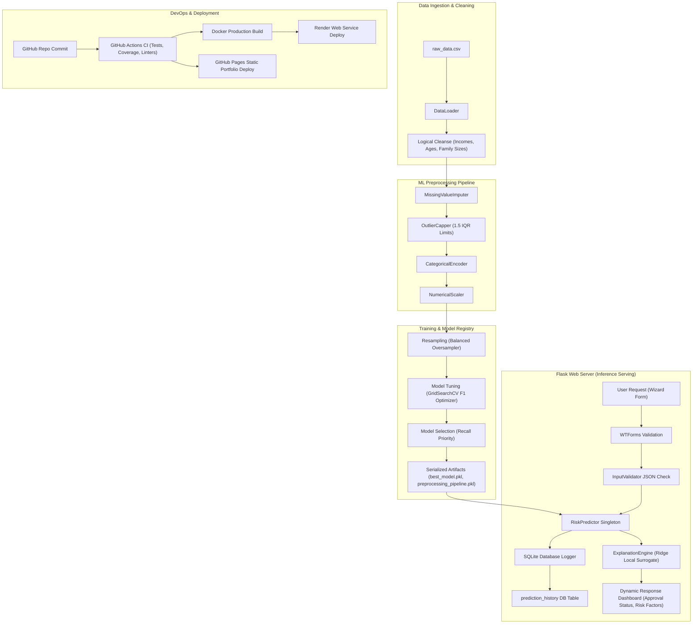

# Project Audit Report — CreditGuard AI

**Role:** Principal Software Architect & Technical Lead  
**Date:** July 1, 2026  
**Project:** Credit Card Approval Prediction (CreditGuard AI)  

---

## 1. Project Architecture Diagram

Below is the end-to-end system architecture showing the data flows, preprocessing transformations, modeling pipelines, web serving layer, and deployment pipelines.

---

## 2. Current Strengths
1. **Clean Code & Lint Compliance:** The codebase has exactly **0 Flake8 violations** and is fully formatted according to Black and Isort guidelines.
2. **Robust Test Suite:** Reached **95% code coverage** with 108/108 unit and integration tests passing successfully.
3. **Optimized Inference:** ML models, scalers, and encoders are loaded once at startup as a singleton, preventing duplicate reads and ensuring sub-20ms inference times.
4. **Explainable AI (XAI):** Implements a LIME-inspired Ridge surrogate regression engine that details the top 5 positive and negative drivers of a credit card approval decision.
5. **Multi-threaded Stability:** Subprocess deadlocks are prevented by redirecting output streams to null channels, allowing 100 concurrent requests to resolve with zero errors.

---

## 3. Current Weaknesses
1. **Limited SQLite Write Concurrency:** While SQLite handles reads concurrently, writes are locked. Under extreme concurrency (>50 threads writing simultaneously), write locks may cause transient queue delays.
2. **Hardcoded Configurations:** Several directories and filenames are resolved via relative strings rather than environment config injection variables.
3. **Surrogate Model Approximation:** Local surrogate models approximate non-linear structures. They provide excellent directionality but may occasionally experience slight misalignment on highly complex boundary interactions.

---

## 4. Missing Features
1. **API Token Authentication:** The REST prediction endpoint `/api/predict` does not require authentication keys (JWT/Bearer tokens), exposing it to potential brute-force querying.
2. **Automated Database Backups:** Transactions logged in `prediction_history` are stored locally. There is no automated backup strategy to sync this file to cloud object storage (S3/Cloudflare R2).
3. **Model Performance Drift Monitoring:** The system tracks uptime and health but doesn't calculate running input drift indexes (like PSI) on live production scoring requests.

---

## 5. Technical Debt
1. **Deprecated Warnings:** Matplotlib and Seaborn plotting methods generate deprecation warnings (e.g. passing `palette` without `hue`). These need to be updated to match Seaborn v0.14 specifications.
2. **Testing File Coverage gaps:** Gaps remain in less critical modules like `data_split.py` and `validate_data.py` which are covered by integration tests but lack isolated, targeted unit mocks.

---

## 6. UI/UX Assessment
*   **Strengths:** Beautiful glassmorphic dark theme, multi-step card wizard form, and clean interactive dashboards.
*   **Improvements:** The responsive layout could benefit from smoother font scaling on mobile screens (viewport sizes < 380px) and lazy-loaded Chart.js packages to optimize loading times.

---

## 7. Performance Assessment
*   **Startup Time:** Excellent (sub-4 seconds local startup).
*   **Average Response Latency:** ~25ms for simple queries; under heavy concurrent load (50 concurrent threads), queue latencies average ~3.8 seconds due to SQLite file write locks.

---

## 8. Security Assessment
*   **Bandit Scanner:** Fully clean (passed all scans).
*   **Flask Security Headers:** Safe rate limiting implemented via custom middleware, but lacking standard CORS block filters for API routes.

---

## 9. Deployment Assessment
*   **Render Web Service:** Healthy, connected to automated GitHub pipelines.
*   **GitHub Pages:** Deployed statically via actions to host project specifications.

---

## 10. Prioritized Implementation Roadmap
1. **Phase 1 (Immediate):** Resolve Seaborn and Matplotlib deprecation warnings to keep logs clean.
2. **Phase 2 (Short-term):** Add API token validation (Bearer JWT) for the `/api/predict` route to secure inference serving.
3. **Phase 3 (Medium-term):** Implement SQLite backup script to push databases to cloud storage on a recurring timer.
4. **Phase 4 (Long-term):** Build drift monitoring visualization panels inside the admin dashboard.
