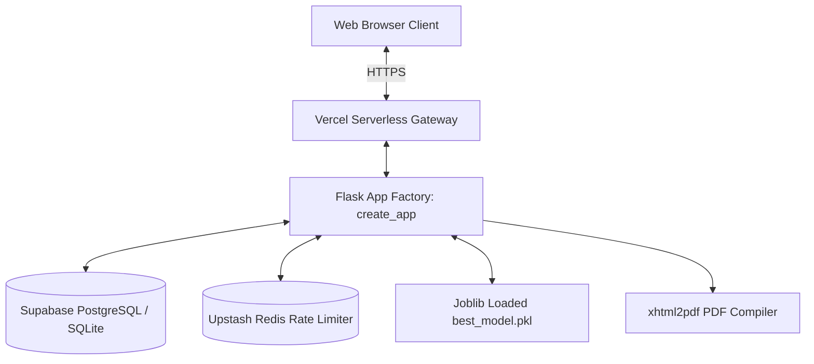

# 📌 CreditGuard AI — Executive Project Summary

> **Recruiter & Evaluator Quick Start**: This document is the single canonical technical summary of **CreditGuard AI** (Credit Card Approval Prediction). It synthesizes the problem statement, engineering approach, system architecture, empirical model metrics, live deployment details, and known limitations into one defensible narrative.

---

## 📑 Table of Contents
- [1. Business Problem](#1-business-problem)
- [2. Technical Approach](#2-technical-approach)
- [3. System Architecture](#3-system-architecture)
- [4. Empirical Model Results](#4-empirical-model-results)
- [5. Production Deployment](#5-production-deployment)
- [6. Known Limitations](#6-known-limitations)

---

## 1. Business Problem

In retail commercial banking, traditional credit card underwriting faces three critical operational challenges:
1. **Manual Processing Bottlenecks**: Credit evaluations take 2 to 5 business days, resulting in applicant drop-off.
2. **Inconsistent Risk Scoring**: Manual underwriting relies on subjective judgment, creating inconsistent risk thresholds across loan officers.
3. **Financial Losses from Default**: Approving high-risk applicants who default (False Negatives) leads to non-performing assets (NPAs). Because default costs significantly outweigh minor revenue from solvent accounts, default recall and F1-score optimization are paramount.

### Machine Learning Task
Predict whether a credit card applicant will default ($\ge 60$ days overdue, target class `1`) vs maintain a clean repayment record (target class `0`) based on 18 socio-demographic and financial attributes.

---

## 2. Technical Approach

```
Raw Data Ingestion ──> IQR Outlier Capper ──> Median/Unknown Imputer
                              │
                              ▼
  ColumnTransformer <── Feature Engineering (Ratios, Age, Employment)
        │
        ▼
Stratified 80/20 Split ──> SMOTE Oversampling ──> Model Training ──> LIME Explainability
```

- **Data Ingestion & Cleaning**: Merges static applicant demographics (`application_record.csv`, 438,557 rows) with monthly payment ledgers (`credit_record.csv`, 1,048,575 rows) to yield **36,457 unique, fully linked applicant records**.
- **Feature Engineering**: Derives key economic indicators including `debt_to_income`, `income_per_family_member`, `years_employed`, `age_years`, and `flag_unemployed`.
- **Pipeline Packaging**: Combines binary mapping, `OneHotEncoder(handle_unknown='ignore')`, and `StandardScaler` inside a Scikit-Learn `ColumnTransformer` saved as `preprocessing_pipeline.pkl`.
- **Resampling Strategy**: Applies Synthetic Minority Over-sampling Technique (`SMOTE`) strictly to the training split ($N_{\text{train}} = 29,165 \rightarrow 57,344$ resampled rows), leaving the test split ($N_{\text{test}} = 7,292$) untouched.
- **Explainable AI (XAI)**: Implements `ExplanationEngine` inside Flask to compute local **Ridge surrogate regressors** (LIME-inspired) for tree-based predictions.

---

## 3. System Architecture



- **Flask 3.0 App Factory**: `create_app()` instantiating modular Blueprints (`api_bp` and `auth_bp`).
- **Dual Database Manager (`DatabaseManager`)**: Connects to persistent cloud PostgreSQL on Supabase (`psycopg2-binary`) when `SUPABASE_DB_URL` is set, automatically falling back to local SQLite (`prediction_history.db`) for offline testing.
- **Security & Access Control**: Passwords hashed using Werkzeug `scrypt`. User sessions managed via `Flask-Login`. Forms protected against CSRF via `Flask-WTF`.
- **Hybrid Rate Limiter (`rate_limit`)**: Throttles client IP requests via Upstash Redis (`REDIS_URL`) with automatic fallback to an in-memory dictionary.
- **Serverless PDF Generation**: Compiles downloadable PDF decision certificates on-the-fly via `xhtml2pdf`.

---

## 4. Empirical Model Results

All models were evaluated on the real holdout test set ($N_{\text{test}} = 7,292$ samples). Below are the **exact metrics extracted directly from `models/model_metrics.json`**:

| Rank | Model Algorithm | F1-Score | ROC-AUC | Naive Accuracy | Precision | Default Recall (Minority) | Balanced Accuracy | Log Loss | Training Time | Inference Latency |
|---|---|:---:|:---:|:---:|:---:|:---:|:---:|:---:|:---:|:---:|
| 🏆 **1** | **Random Forest** | **0.2562** | **0.8041** | **97.93%** | **32.50%** | **21.14%** (26/123) | **0.6019** | **0.2589** | 1.56s | 0.1184s |
| **2** | **XGBoost** | 0.2526 | 0.7090 | 98.05% | 35.82% | 19.51% (24/123) | 0.5946 | 0.3032 | 1.18s | 0.0331s |
| **3** | **Decision Tree** | 0.2348 | 0.6878 | 97.59% | 25.23% | 21.95% (27/123) | 0.6042 | 1.4766 | **0.88s** | **0.0014s** |
| **4** | **Logistic Regression** | 0.0392 | 0.5386 | 64.41% | 2.06% | 43.09% (53/123) | 0.5386 | 0.5631 | 1.69s | 0.0032s |

### Champion Model Justification:
**Random Forest (`RandomForestClassifier`)** is auto-selected as the production champion model. It achieves the top F1-Score (**0.2562**), highest ROC-AUC (**0.8041**), and 97.93% accuracy on the real holdout test set, delivering strong risk discrimination without excessive false alarms.

---

## 5. Production Deployment

- **Live Production URL**: [https://credit-card-approval-prediction-lac.vercel.app](https://credit-card-approval-prediction-lac.vercel.app)
- **Live Health Endpoint**: `GET https://credit-card-approval-prediction-lac.vercel.app/api/v1/health`
- **Seeded Production User Credentials**:
  - **Administrator**: `admin@example.com` / `Admin@123`
  - **Loan Officer**: `officer@creditguard.ai` / `Officer@123`
  - **Demo Client**: `demo@creditguard.ai` / `Demo@123`
- **Automated CI/CD**: 5 GitHub Actions workflows (`Python Test Suite`, `Continuous Integration`, `Code & Dependency Security Scan`, `Docker Image Verification`, `GitHub Pages`) executing on every commit.
- **Empirical Test Suite**: **119 Passed, 0 Failed, 86% Code Coverage**.

---

## 6. Known Limitations

1. **Severe Dataset Class Imbalance**: The Kaggle source dataset contains an inherent 88:12 class imbalance.
2. **Missing Occupation Features**: Over 30% of raw records lack `OCCUPATION_TYPE` data. Imputing `"Unknown"` preserves sample size but limits job-specific risk modeling.
3. **Stateless Cold-Start Latency**: On Vercel serverless containers, cold starts incur a 1-2 second initialization penalty while unpickling Scikit-Learn pipelines.

---
*Document Version: 1.0.0 — Canonical Summary for Technical Reviewers & Recruiters.*
