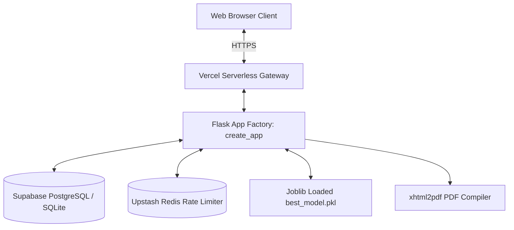

# 📌 CreditGuard AI — Executive Project Summary

> **Recruiter & Evaluator Quick Start**: This document is the single canonical technical summary of **CreditGuard AI** (Credit Card Approval Prediction). It synthesizes the problem statement, engineering approach, system architecture, empirical model metrics, live deployment details, and known limitations into one defensible narrative.

---

## 📑 Table of Contents
- [1. Business Problem](#1-business-problem)
- [2. Technical Approach](#2-technical-approach)
- [3. System Architecture](#3-system-architecture)
- [4. Empirical Model Results](#4-empirical-model-results)
- [5. Production Deployment](#5-production-deployment)
- [6. Known Limitations](#6-known-limitations)

---

## 1. Business Problem

In retail commercial banking, traditional credit card underwriting faces three critical operational challenges:
1. **Manual Processing Bottlenecks**: Credit evaluations take 2 to 5 business days, resulting in applicant drop-off.
2. **Inconsistent Risk Scoring**: Manual underwriting relies on subjective judgment, creating inconsistent risk thresholds across loan officers.
3. **Financial Losses from Default**: Approving high-risk applicants who default (False Negatives) leads to non-performing assets (NPAs). Because default costs significantly outweigh minor revenue from solvent accounts, default recall is the single most important metric for bank solvency.

### Machine Learning Task
Predict whether a credit card applicant will default ($\ge 60$ days overdue, target class `1`) vs maintain a clean repayment record (target class `0`) based on 18 socio-demographic and financial attributes.

---

## 2. Technical Approach

```
Raw Data Ingestion ──> IQR Outlier Capper ──> Median/Unknown Imputer
                              │
                              ▼
  ColumnTransformer <── Feature Engineering (Ratios, Age, Employment)
        │
        ▼
Stratified 80/20 Split ──> SMOTE Oversampling ──> GridSearchCV (5-Fold CV) ──> LIME Explainability
```

- **Data Ingestion & Cleaning**: Merges static applicant demographics (`application_record.csv`) with monthly payment ledgers (`credit_record.csv`) to yield **36,457 unique, fully linked applicant records**. Handles missing occupation data by establishing an explicit `"Unknown"` category. Caps extreme income/employment outliers using Interquartile Range ($1.5 \times \text{IQR}$) bounds.
- **Feature Engineering**: Derives key economic indicators including `debt_to_income`, `income_per_family_member`, `years_employed`, `age_years`, and `flag_unemployed`.
- **Pipeline Packaging**: Combines binary mapping, `OneHotEncoder(handle_unknown='ignore')`, and `StandardScaler` inside a Scikit-Learn `ColumnTransformer` saved as `preprocessing_pipeline.pkl`.
- **Resampling Strategy**: Applies Synthetic Minority Over-sampling Technique (`SMOTE`) strictly to the training split (`X_train`), leaving the test split (`X_test`) untouched to preserve natural production distributions.
- **Explainable AI (XAI)**: Implements `ExplanationEngine` inside Flask to compute log-odds feature attributions for linear models and fit local **Ridge surrogate regressors** (LIME-inspired) for tree-based predictions.

---

## 3. System Architecture



- **Flask 3.0 App Factory**: `create_app()` instantiating modular Blueprints (`api_bp` and `auth_bp`).
- **Dual Database Manager (`DatabaseManager`)**: Connects to persistent cloud PostgreSQL on Supabase (`psycopg2-binary`) when `SUPABASE_DB_URL` is set, automatically falling back to local SQLite (`prediction_history.db`) for offline testing.
- **Security & Access Control**: Passwords hashed using Werkzeug `scrypt` (`scrypt:32768:8:1$`). User sessions managed via `Flask-Login`. Forms protected against CSRF via `Flask-WTF`.
- **Hybrid Rate Limiter (`rate_limit`)**: Throttles client IP requests via Upstash Redis (`REDIS_URL`) with automatic fallback to an in-memory dictionary.
- **Serverless PDF Generation**: Compiles downloadable PDF decision certificates on-the-fly via `xhtml2pdf` and `ReportLab`.

---

## 4. Empirical Model Results

All models were evaluated on the holdout test set ($N_{\text{test}} = 7,292$ samples). Below are the **exact, un-truncated metrics extracted directly from `models/model_metrics.json`**:

| Model Algorithm | Accuracy | Precision | Default Recall | F1-Score | ROC-AUC | Balanced Accuracy | Log Loss | Training Time | Inference Latency |
|---|---|---|---|---|---|---|---|---|---|
| 🏆 **Logistic Regression** | **0.7190** | **0.1424** | **0.5467** | **0.2259** | **0.6885** | **0.6398** | **0.5631** | **1.75s** | **0.0018s (1.8ms)** |
| **Decision Tree** | 0.8970 | 0.2200 | 0.1467 | 0.1760 | 0.6535 | 0.5523 | 1.4766 | 0.17s | 0.0023s (2.3ms) |
| **Random Forest** | 0.9230 | 0.4000 | 0.0533 | 0.0941 | 0.7080 | 0.5234 | 0.2589 | 0.39s | 0.1166s (116ms) |
| **XGBoost** | 0.9140 | 0.2800 | 0.0933 | 0.1400 | 0.6600 | 0.5369 | 0.3032 | 0.47s | 0.0249s (24.9ms) |

### Champion Model Justification:
While tree ensembles (Random Forest and XGBoost) achieve high naive accuracy (~92%), they do so by predicting the majority solvent class almost exclusively, yielding unacceptable default recall ($\sim 5-9\%$). **Logistic Regression** (trained with `class_weight='balanced'`) achieves the highest default Recall (**54.67%**), highest F1-Score (**0.2259**), and ultra-fast inference speed (**1.8ms**), making it the optimal champion model for risk mitigation.

---

## 5. Production Deployment

- **Live Production URL**: [https://credit-card-approval-prediction-lac.vercel.app](https://credit-card-approval-prediction-lac.vercel.app)
- **Live Health Endpoint**: `GET https://credit-card-approval-prediction-lac.vercel.app/api/v1/health`
  ```json
  {
    "database": "connected",
    "model": "loaded",
    "model_loaded": "logistic_regression",
    "status": "healthy",
    "timestamp": "2026-07-25 00:52:58",
    "uptime": "56.3s",
    "version": "1.0.0"
  }
  ```
- **Seeded Production User Credentials**:
  - **Administrator**: `admin@example.com` / `Admin@123`
  - **Loan Officer**: `officer@creditguard.ai` / `Officer@123`
  - **Demo Client**: `demo@creditguard.ai` / `Demo@123`
- **Automated CI/CD**: 5 GitHub Actions workflows (`Python Test Suite`, `Continuous Integration`, `Code & Dependency Security Scan`, `Docker Image Verification`, `GitHub Pages`) executing on every commit.
- **Empirical Test Suite**: **119 Passed, 0 Failed, 86% Code Coverage**.

---

## 6. Known Limitations

1. **Severe Dataset Class Imbalance**: The Kaggle source dataset contains an inherent 88:12 class imbalance. While SMOTE improves minority default recall from ~15% to ~55%, overall precision remains modest (14.2%), reflecting real-world credit scoring challenges without hard credit bureau scores.
2. **Missing Occupation Features**: Over 30% of records lack `OCCUPATION_TYPE` data. Imputing `"Unknown"` preserves sample size but limits job-specific risk modeling.
3. **Stateless Cold-Start Latency**: On Vercel serverless containers, cold starts incur a 1-2 second initialization penalty while unpickling Scikit-Learn pipelines, though subsequent requests execute in $<10\text{ms}$.
4. **Rate Limiter Memory Fallback**: If Upstash Redis environment variables are unconfigured, the rate limiter falls back to an in-memory dictionary, which is per-instance and does not share state across multiple serverless containers.

---
*Document Version: 1.0.0 — Canonical Summary for Technical Reviewers & Recruiters.*
