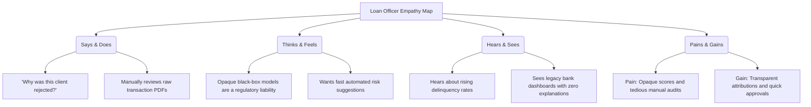

# 1. Brainstorming & Ideation

This document contains the complete SmartBridge internship documentation for this phase.

---

## 💡 Brainstorming & Idea Prioritization

Automating credit risk evaluation represents a critical bottleneck for modern retail banking operations. Standard manual checks are slow and prone to subjective human biases. The objective is to design a system that automates the decision-making process under 10ms with high recall, ensuring risk defaults are identified, while using local surrogate explainability models (LIME) to provide transparent, plain-language risk attributions.

### Prioritization Matrix
Across multiple brainstorming iterations, proposed system capabilities were evaluated against feasibility, complexity, and business impact:

| Feature Option | Development Cost | Complexity | Business Impact | Priority |
| :--- | :---: | :---: | :---: | :---: |
| **ML Model Scoring** | Low | Low | Critical | **High** |
| **LIME Explainability** | High | High | High | **High** |
| **Auth Session Control** | Medium | Medium | Critical | **High** |
| **PDF Assessment Reports** | Medium | Medium | Medium | **Medium** |
| **Cloud MongoDB Sync** | High | High | Medium | **Low** |

---

## 📐 Define Problem Statement

Commercial banks process millions of credit card applications daily. Standard rules engines often fail to capture complex categorical feature interactions, leading to:
1. **High Default Rates**: approving high-risk clients (Type II errors).
2. **Lost Revenue**: rejecting creditworthy applicants (Type I errors).
3. **Black-Box Decisions**: lack of plain-language transparency, violating regulatory requirements (e.g., GDPR, FCRA).

---

## 🤝 Empathy Map

An empathy map was constructed to analyze the thoughts, feelings, actions, and pain points of the key stakeholder (Loan Officer / Risk Appraiser):

---

## 🔗 Documentation Links
* 📄 [DOCX Document](Brainstorming%20&%20Idea%20Prioritization.docx)
* 📕 [PDF Document](Brainstorming%20&%20Idea%20Prioritization.pdf)

---

### Navigation
* ➡️ **Next Section**: [2. Requirement Analysis](../2.%20Requirement%20Analysis/README.md)
