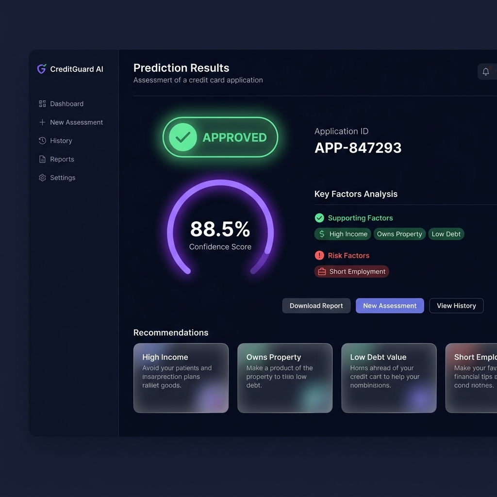

# 8. Project Demonstration

This document contains the complete SmartBridge internship documentation for this phase.

---

## 🎥 Production Demonstration

A video walkthrough of all platform capabilities has been recorded:
*   **Video Asset Path**: `8_Project_Demonstration/Demo_Video.mp4`
*   **Live Deploy**: [credit-card-approval-prediction-lac.vercel.app](https://credit-card-approval-prediction-lac.vercel.app)

### Interactive Wizard Showcase
The user onboarding layout with live validation and result gauges:

  

---

## 🔮 Future Scalability Plan
1. **Tree SHAP attributions**: Replace local surrogates with native tree SHAP metrics.
2. **Supabase Integration**: Migrating SQLite records to cloud clusters.
3. **Fairness checks**: Integrating AIF360 bias mitigation tests in GitHub CI.

---

## 🔗 Documentation Links
* 📄 [DOCX Document](Communication.docx)
* 📕 [PDF Document](Communication.pdf)

---

### Navigation
* ⬅️ **Previous Section**: [7. Project Documentation](../7.%20Project%20Documentation/README.md)
