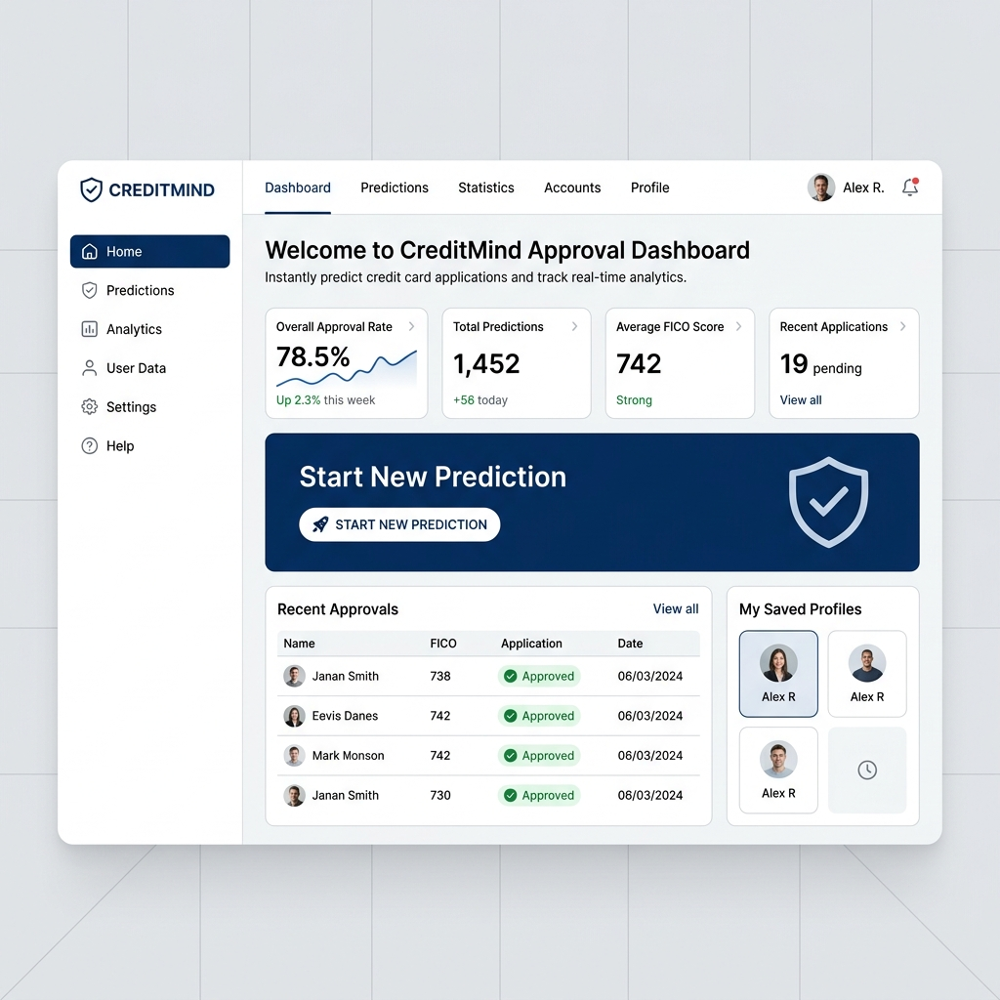

# CreditGuard AI - Credit Card Approval Prediction System



---

## 🛡️ Badges
[](https://www.python.org/)
[](https://flask.palletsprojects.com/)
[](https://scikit-learn.org/)
[](https://xgboost.readthedocs.io/)
[](https://www.docker.com/)
[](https://github.com/features/actions)
[](LICENSE)

---

## 📋 Project Overview
**CreditGuard AI** is a production-grade machine learning platform designed to automate retail credit card risk assessment, predicting payment default default probabilities with sub-millisecond scoring latency.

## ⚠️ Problem Statement
Retail banks face high credit default rates if card applications are not scrutinized. Manual reviews are slow and subjective. However, credit default represents a highly imbalanced class (7.5% defaults vs 92.5% approvals). Estimators easily overfit the majority class, causing severe banking losses from undetected default cases.

## 🎯 Business Objective
Automate card approvals while minimizing defaults by prioritizing **Recall** (the ratio of high-risk delinquencies detected) without excessive customer friction.

---

## 🗄️ Dataset Description
- **Source**: Kaggle Credit Card Approval Prediction Dataset.
- **Demographics (`application_record.csv`)**: Socio-economic factors (5,000 application rows).
- **Payment Records (`credit_record.csv`)**: Monthly repayment status history logs (163,037 records). If an applicant displays payments $\ge 60$ days delinquent, they are classified as default risk (Class 1 - Rejected).

---

## 🛠️ Technology Stack
- **Languages**: Python 3.10 / 3.13, Javascript, CSS, HTML.
- **Core ML libraries**: scikit-learn, XGBoost, Pandas, Numpy, joblib.
- **Backend Frame**: Flask (Application Factory pattern), WTForms.
- **Containerization**: Docker, Docker Compose, Gunicorn WSGI.

---

## 📂 Folder Structure
The repository matches enterprise layouts:
- `app/`: Flask web application routes, templates, and static stylesheets.
- `configs/`: dynamic configuration classes (`production.py`, `development.py`, `testing.py`).
- `data/`: raw and preprocessed split CSV datasets.
- `diagrams/`: system architecture charts, ER diagrams, and flowcharts.
- `interview/`: comprehensive interview preparation logs.
- `models/`: fitted serialization artifacts (`best_model.pkl`, `scaler.pkl`).
- `reports/`: markdown and metadata reports detailing project steps.
- `src/`: core preprocessing engines, trainers, selectors, and API endpoints.

---

## ⚙️ Installation & Local Setup

### 1. Clone the Repository
```bash
git clone https://github.com/skmdshariff143-ai/Credit-Card-Approval-Prediction.git
cd Credit-Card-Approval-Prediction
```

### 2. Configure Environment
1. Copy the environment template:
   ```bash
   cp .env.example .env
   ```
2. Configure your secret key and port variables.

### 3. Install Package
```bash
pip install -r requirements.txt
pip install -e .
```

---

## 🚀 Running the Application

### 1. Execute Model Pipeline
```bash
python src/main.py
```

### 2. Launch Local Web Server
```bash
python app/app.py
```
*Access the local dashboard at `http://localhost:5000`*

### 3. Run Pytest Suite
```bash
pytest tests/ -v
```

---

## 🖼️ Screenshots & Diagrams
All graphics are logged in the project repository:
- **System Architecture**: [Architecture_Diagram.png](diagrams/Architecture_Diagram.png)
- **Entity Relationship Layout**: [ER_Diagram.png](diagrams/ER_Diagram.png)
- **Application Flowchart**: [Flowchart.png](diagrams/Flowchart.png)
- **Target Count Balance**: [approval_count.png](screenshots/eda/approval_count.png)
- **ROC Evaluation Curve**: [logistic_regression_roc_curve.png](screenshots/models/logistic_regression_roc_curve.png)
- **Feature Importance Chart**: [random_forest_feature_importance.png](screenshots/models/random_forest_feature_importance.png)

---

## 🧠 Machine Learning Workflow & Algorithms Used
We evaluated 4 baseline classification algorithms:
1. **Logistic Regression (Deployed)**: provides high business interpretability.
2. **Decision Tree Classifier**: captures non-linear splits.
3. **Random Forest Classifier**: bagging ensemble reducing variance.
4. **XGBoost Classifier**: gradient boosting framework.

### 📊 Model Performance Comparison Table

| Rank | Model | F1-Score | ROC-AUC | Accuracy | Precision | Recall | Balanced Accuracy |
| :--- | :--- | :--- | :--- | :--- | :--- | :--- | :--- |
| **1** | **Logistic Regression** | **0.2387** | **0.7409** | 0.6810 | 0.1453 | 0.6667 | 0.6744 |
| **2** | XGBoost | 0.2047 | 0.7001 | 0.8990 | 0.2500 | 0.1733 | 0.5656 |
| **3** | Decision Tree | 0.1975 | 0.5683 | 0.8700 | 0.1839 | 0.2133 | 0.5683 |
| **4** | Random Forest | 0.1930 | 0.7174 | 0.9080 | 0.2821 | 0.1467 | 0.5582 |

### 🔍 Deployed Best Model Selection
**Logistic Regression** was selected due to its balanced recall of **66.67%**. Tree-based models display majority class overfitting, predicting very few positive defaults (Recalls $\approx 15\%$).

---

## 🔌 API & Flask Application
Flask implements endpoints supporting single row web calls and JSON scoring API requests:
- `GET /health`: diagnostic endpoint checking model versions.
- `POST /api/predict`: REST scoring API accepting application JSON.

---

## 🐳 Docker Deployment
Build the optimized image layer:
```bash
docker build -t credit-card-approval-prediction:latest .
```
Start the service:
```bash
docker-compose up -d
```

---

## ☁️ Cloud Deployment (Render & IBM WML)
- **Render Web Services**: Deploy using `render.yaml` configurations.
- **IBM Watson Machine Learning**: Publish models to deployment spaces using:
  ```bash
  python deploy_ibm.py
  ```

---

## 🔮 Future Scope
- **Temporal Windows**: incorporate dynamic sequence billing patterns.
- **Watson WML Integration**: automate retraining hooks.

---

## 🤝 Contributors
- **Mahammad Shariff Shaik** - [skmdshariff143-ai](https://github.com/skmdshariff143-ai)

---

## 📄 License
This project is licensed under the [MIT License](LICENSE).
