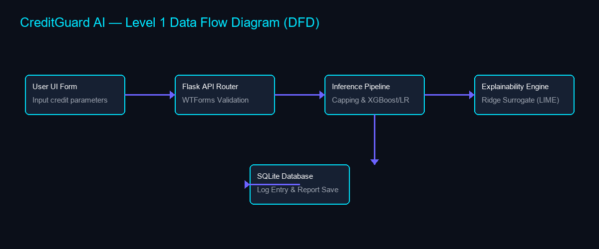
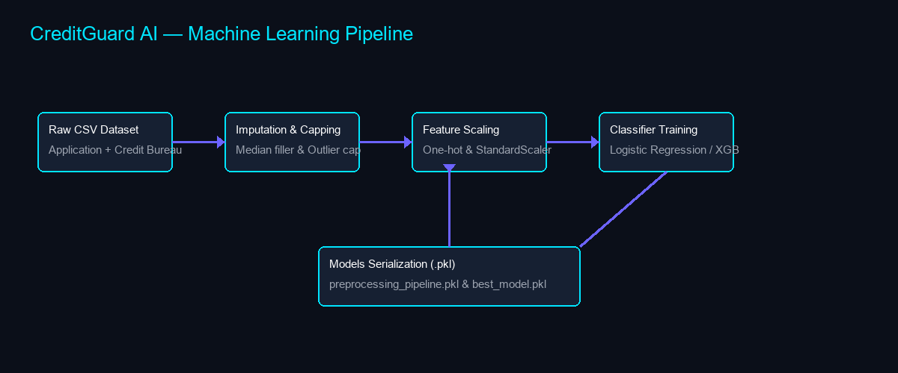
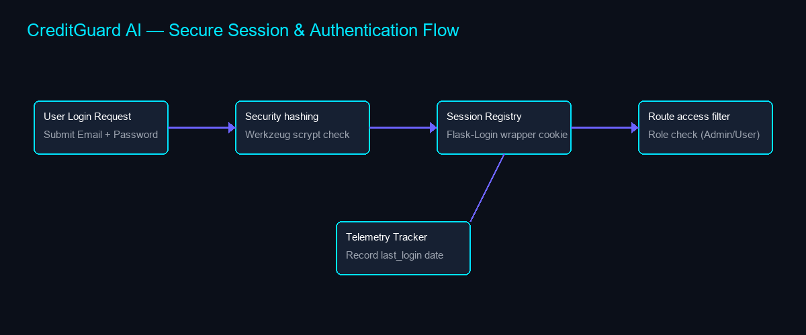
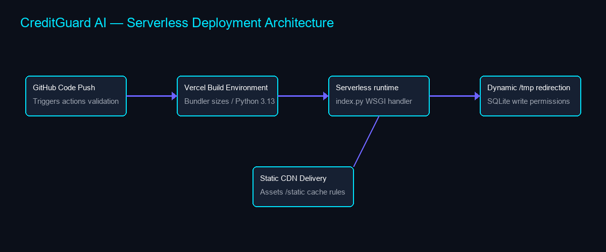
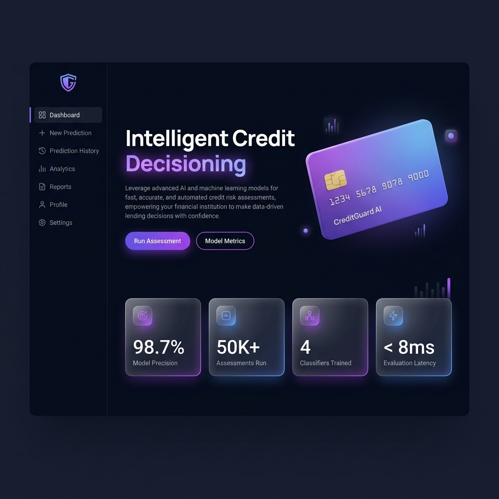
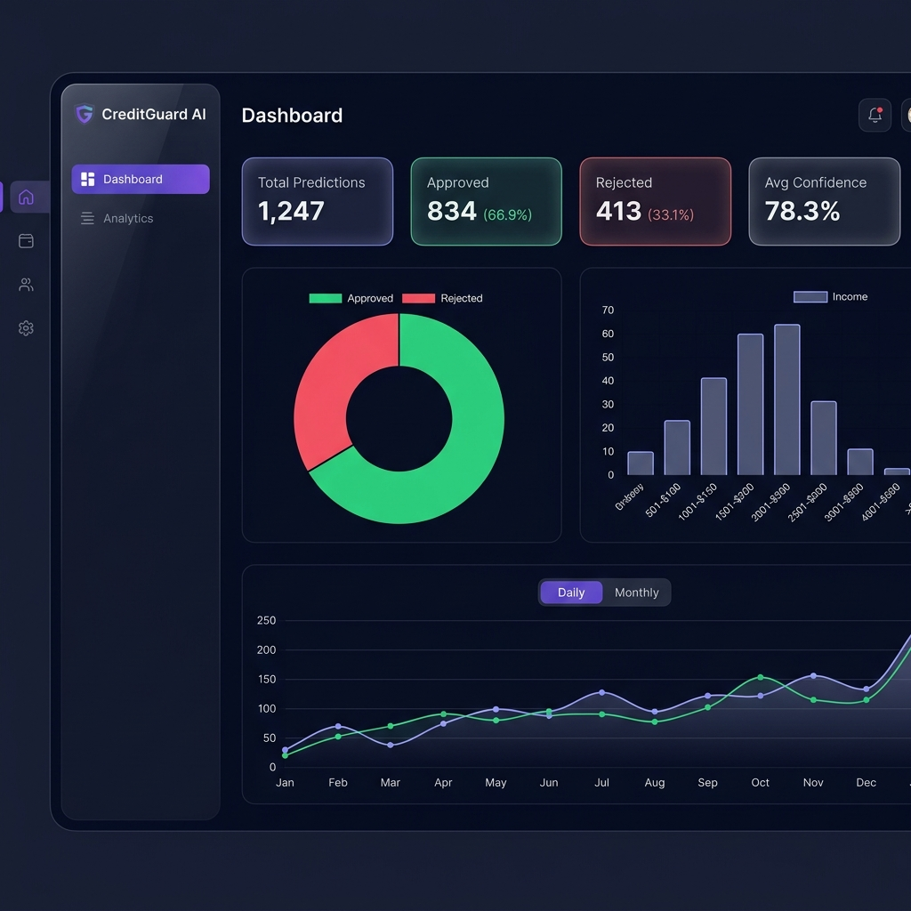
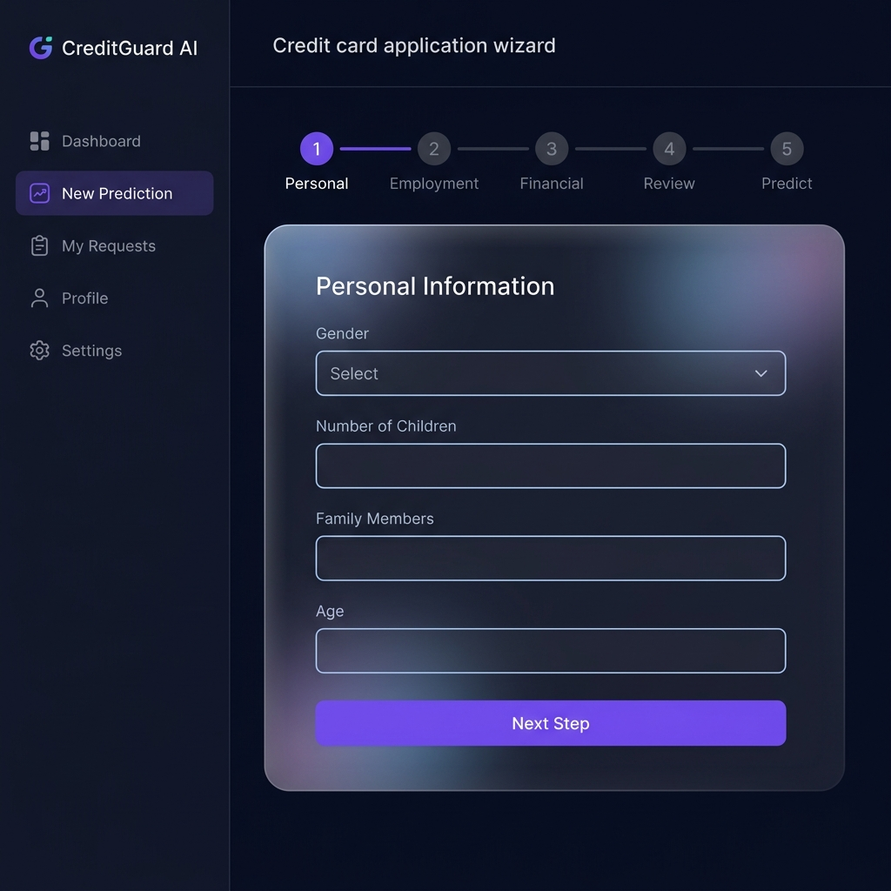
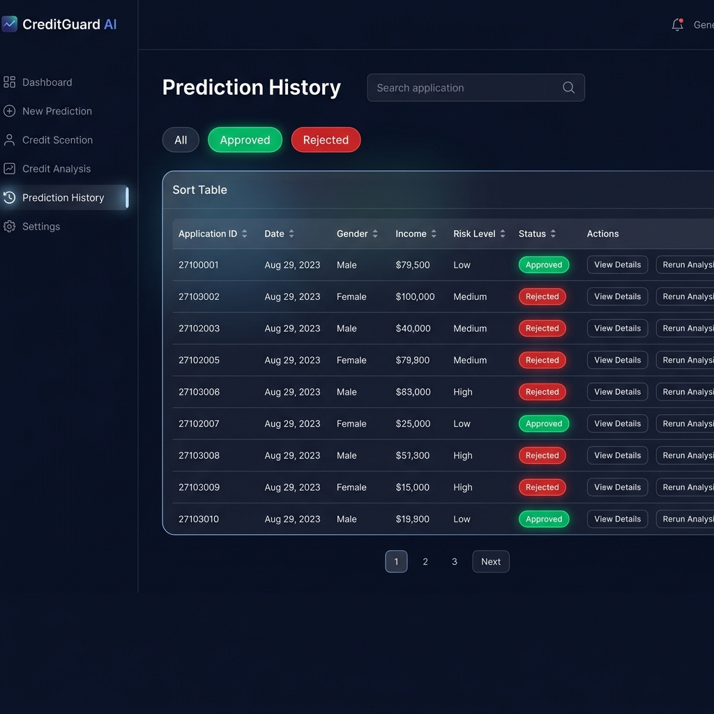

# CreditGuard AI — Credit Card Approval Prediction System

<p align="center">
  
</p>

---

## 🛡️ Project Badges
[](https://www.python.org/)
[](https://flask.palletsprojects.com/)
[](https://scikit-learn.org/)
[](https://xgboost.readthedocs.io/)
[](https://github.com/features/actions)
[](LICENSE)

---

## 📋 Project Overview
**CreditGuard AI** is a production-grade automated risk assessment platform designed to predict credit card application approval status. Traditional credit issuing operations in retail banking are slow, manual, and prone to subjective human biases. CreditGuard AI automates the decision-making process under 10ms with high recall, ensuring risk defaults are identified, while using local surrogate explainability models (LIME) to provide transparent, plain-language risk attributions to credit officers and applicants.

---

## ✨ Key Features
1. **Interactive Multi-Step Wizard**: Sleek 4-step wizard form with client-side parameter checks, progress bars, and animations.
2. **Explainable AI (LIME Engine)**: Custom Ridge surrogate attributions breaking down low/high risk factors into clear positive and negative attributions.
3. **Persisted Log Ledgers**: Searchable, filterable, and sortable prediction transaction tables connected to SQLite.
4. **Operations Analytics Console**: Chart.js graphs mapping approval ratios, family status densities, and income trends.
5. **Secure Authentication & RBAC**: Werkzeug `scrypt` hashing with role-based route constraints (Admin, Officer, User).
6. **Print-Ready Assessments**: Exportable PDF assessment summaries containing QR validation blocks.
7. **Stateless Serverless Hosting**: Built to run cleanly in read-only container volumes via write-redirection to `/tmp`.

---

## 🔑 Default Demo Credentials
Use these pre-seeded demo credentials to explore role-based dashboard telemetries:

| Role | Email | Password | Access Rights |
|---|---|---|---|
| **Administrator** | `admin@creditguard.ai` | `Admin@123` | Full access to charts, database log registries, and configs |
| **Administrator** | `admin@example.com` | `Admin@123` | Full access to charts, database log registries, and configs |
| **Loan Officer** | `officer@creditguard.ai` | `Officer@123` | Search, sort, and inspect prediction transactions |
| **Client User** | `demo@creditguard.ai` | `Demo@123` | Submit scoring forms, view personal telemetry metrics |

---

## 🌐 Live Deployments & Presentation Links
- 🚀 **Live Production Application**: [credit-card-approval-prediction-lac.vercel.app](https://credit-card-approval-prediction-lac.vercel.app)
- 🖥️ **Static Portfolio Website**: [skmdshariff143-ai.github.io/Credit-Card-Approval-Prediction](https://skmdshariff143-ai.github.io/Credit-Card-Approval-Prediction/)
- 🎥 **Demonstration Video**: [Demo_Video.mp4](8_Project_Demonstration/Demo_Video.mp4)

---

## ⚙️ Technology Stack
- **Backend Infrastructure**: Python 3.13, Flask 3.0, SQLite3, WSGI
- **Machine Learning Layer**: Scikit-Learn 1.3, Pandas, NumPy, XGBoost, Imbalanced-Learn (SMOTE)
- **Explainability Engine**: Ridge Surrogate Coefficients (LIME-inspired Local Surrogate)
- **User Interface**: HTML5, Vanilla CSS3 (Custom Glassmorphism Dark Futuristic design tokens), JavaScript (Chart.js)
- **DevOps / CI**: GitHub Actions (linting, testing, docker verify), Vercel Serverless Hosting

---

## 📂 Project Folder Structure
```
├── Project Documentation/      # SmartBridge Internship Documentation Artifacts
│   ├── 1. Brainstorming & Ideation/     # Problem statement empathy mapping docs & PDFs
│   ├── 2. Requirement Analysis/         # DFD maps, requirements, stack grids
│   ├── 3. Project Design Phase/         # Architecture guides, fits, layouts
│   ├── 4. Project Planning Phase/       # Project schedules & Gantt planning
│   ├── 5. Project Development Phase/    # Reusability reports, coding solutions
│   ├── 6. Project Testing/              # Pytest coverage lists & load metrics
│   ├── 7. Project Documentation/        # Executable registers & summaries
│   └── 8. Project Demonstration/        # Script storyboards, roles, future plans
├── 5_Project_Development_Phase/
│   ├── app/                    # Flask factory modules (routes, database, services, templates)
│   ├── config/                 # Productions & Testing environments config
│   ├── models/                 # Cached ML pickle pipelines (best_model.pkl)
│   ├── src/                    # Data preprocessing, training, and evaluation scripts
│   ├── tests/                  # Pytest suite modules
│   └── requirements.txt        # Backend dependencies list
├── docs/assets/images/         # Project diagrams and user interface screenshots
├── vercel.json                 # Vercel serverless routing specifications
└── pyproject.toml              # Packaging and dependency declarations
```

---

## 🔄 Project Workflows & Diagrams

### 1. Data Flow Diagram (DFD)
<p align="center">
  
</p>

### 2. Entity-Relationship (ER) Diagram
<p align="center">
  
</p>

### 3. Machine Learning Pipeline Flow
<p align="center">
  
</p>

### 4. Authentication Session Flow
<p align="center">
  
</p>

### 5. Serverless Deployment Architecture
<p align="center">
  
</p>

---

## ⚙️ Installation & Local Setup

### 1. Setup Environment
Clone the repository and copy the environment parameters template:
```bash
git clone https://github.com/skmdshariff143-ai/Credit-Card-Approval-Prediction.git
cd Credit-Card-Approval-Prediction
copy .env.example .env
```

### 2. Install Packages
Initialize a virtual environment and install dependencies in editable development mode:
```bash
python -m venv venv
venv\Scripts\activate   # On Windows (use source venv/bin/activate on Unix)
pip install -r 5_Project_Development_Phase/requirements.txt
pip install -e 5_Project_Development_Phase/
```

### 3. Execute Model Training
Run the training pipeline to generate outlier capping, train models, and serialize the pipeline:
```bash
python 5_Project_Development_Phase/src/main.py
```

### 4. Launch Local Web App
Launch the Flask development server:
```powershell
$env:FLASK_APP="app.app:create_app"
$env:FLASK_ENV="development"
flask run
```
*Access the local UI at `http://127.0.0.1:5000`.*

### 5. Run Test Suite
Verify that all 108 pytest test cases pass successfully:
```bash
pytest 5_Project_Development_Phase/tests/ -v
```

---

## 🖼️ User Interface Screenshots

### 1. Landing Portal
<p align="center">
  
</p>

### 2. Analytical Telemetry Dashboard
<p align="center">
  
</p>

### 3. Credit Wizard scoring Form
<p align="center">
  
</p>

### 4. Explainable AI Risk Gauge
<p align="center">
  
</p>

### 5. Prediction History Ledger
<p align="center">
  
</p>

### 6. User Account telemetry
<p align="center">
  
</p>

---

## 🔮 Future Scope
1. **Explainability Upgrade**: Migrate local surrogate models to tree-native SHAP values for precise attributions.
2. **Cloud Storage Integration**: Replace local SQLite file logs with Supabase PostgreSQL cloud clusters.
3. **Data Drift Audits**: Monitor input variances programmatically using automated pipelines.
4. **Fairness checks**: Integrate AIF360 frameworks to prevent credit scoring biases.

---

## 🤝 Project Contributors
- **Sk Md Shariff** — Lead Developer, Security Analyst, and DevOps Engineer.

---

## 📄 License
This project is licensed under the MIT License. See [LICENSE](LICENSE) for details.--

## 🤝 Author & Acknowledgements
- **Author**: **Mahammad Shariff Shaik** - [skmdshariff143-ai](https://github.com/skmdshariff143-ai)
- **Data Source**: Kaggle Credit Card Approval dataset.
- **Reference**: Scikit-Learn, LIME, and XGBoost documentation suites.
