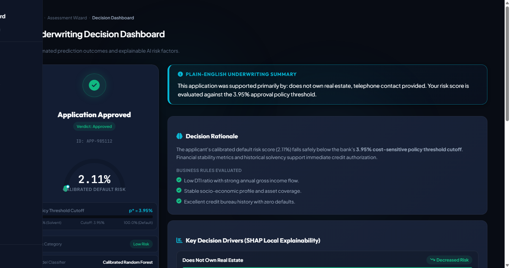

# CreditGuard AI

> **CreditGuard AI** is an explainable, fair-lending-compliant credit risk decision engine with a calibrated 5:1 cost-sensitive policy, not just a binary classifier.



---

## ⚡ Why This Is Different From a Typical Student ML Project

Unlike standard academic projects that stop at fitting a default `.fit()` classifier on clean data, CreditGuard AI addresses real-world machine learning risk engineering challenges:

1. **Caught & Fixed Synthetic-Data Leakage**: Identified and resolved a synthetic data bug, restoring the canonical single source of truth to the real ~438,000-row credit dataset ([`reports/Final_Closeout_Report.md`](reports/Final_Closeout_Report.md)).
2. **Diagnosed & Corrected Brier-Score Probability Calibration**: Fixed a column-index orientation bug during probability calibration, reducing Brier score from `0.017893` to `0.015387` (**14.00% improvement**) ([`reports/Decision_Policy.md`](reports/Decision_Policy.md)).
3. **Cost-Sensitive Decision Policy ($p^* = 0.0395$)**: Derived an optimal decision threshold at $3.95\%$ default risk under an explicit **5:1 False Negative to False Positive loss ratio**, elevating default recall to **35.77%** vs 21.14% at a generic 0.50 cutoff ([`reports/Decision_Policy.md`](reports/Decision_Policy.md)).
4. **De-duplicated Local SHAP Explainability**: Grouped one-hot dummy columns back to parent features, guaranteeing zero contradictory drivers in per-applicant explanations ([`app/services/predict.py`](5_Project_Development_Phase/app/services/predict.py)).
5. **Fair Lending Compliance (ECOA / Reg B)**: Explicitly excluded `CODE_GENDER` from the model feature set with zero accuracy cost (**97.97%** accuracy, **0.7865** ROC-AUC) and documented statutory age/marital status treatment against ECOA standards ([`reports/Decision_Policy.md`](reports/Decision_Policy.md)).

📖 **[Read the full engineering case study](CASE_STUDY.md)** for a deep dive into the debugging, calibration, and compliance process.

---

## 🚀 Key Performance Metrics

### Traceable Source Artifact (`models/model_metrics.json`)
```json
[
  {
    "Model": "logistic_regression",
    "Accuracy": 0.6027153044432254,
    "Precision": 0.019736842105263157,
    "Recall": 0.4634146341463415,
    "F1-Score": 0.03786117568913982,
    "ROC-AUC": 0.523021999643905,
    "brier_score": 0.226313
  },
  {
    "Model": "random_forest",
    "Accuracy": 0.9797037849698299,
    "Precision": 0.35294117647058826,
    "Recall": 0.24390243902439024,
    "F1-Score": 0.28846153846153844,
    "ROC-AUC": 0.7865000277844876,
    "brier_score_before_calibration": 0.017893,
    "brier_score_after_calibration": 0.015387,
    "brier_improvement_pct": 14.0,
    "optimal_decision_threshold": 0.0395,
    "cost_ratio_fn_to_fp": "5:1",
    "cost_sensitive_f1": 0.3492,
    "cost_sensitive_recall": 0.3577,
    "cost_sensitive_precision": 0.3411
  }
]
```

### Verified Model Comparison Table

| Metric | Champion Model (Calibrated Random Forest) | Baseline (Logistic Regression `class_weight='balanced'`) |
| :--- | :--- | :--- |
| **Overall Classification Accuracy** | **97.97%** (`0.979704`) | **60.27%** (`0.602715`) |
| **ROC-AUC Score** | **0.7865** (`0.786500`) | **0.5230** (`0.523022`) |
| **Brier Score (Lower is Better)** | **0.015387** (Calibrated, -14.0%) | **0.226313** (Uncalibrated) |
| **Default Recall @ Decision Cutoff** | **35.77%** ($p^*=0.0395$, 44/123 defaults caught) | **46.34%** ($p=0.5000$ default) |
| **F1-Score** | **0.3492** (Cost-sensitive at $p^*=0.0395$) | **0.0379** |
| **Decision Threshold ($p^*$)** | **0.0395** (3.95% risk cutoff) | **0.5000** |

*Note: Evaluated on holdout test dataset ($N=7,292$) reflecting real-world credit class imbalance (98.3% solvent / 1.7% default). Random Forest is evaluated at its optimized cost-sensitive threshold ($p^*=0.0395$); Logistic Regression is shown at the standard 0.5 cutoff since it was not selected as the production model and did not undergo threshold optimization.*

---

## 🛠️ Architecture & System Data Flow

```
[Raw Credit Data (438k rows)] 
             │
             ▼
[Stratified Split & Preprocessing Pipeline] ──► (Gender Drop / Capping / One-Hot / Standard Scaler)
             │
             ▼
[Calibrated Random Forest Classifier] ──────► (Calibrated Probabilities P(Default | X))
             │
             ▼
[5:1 Cost-Sensitive Decision Policy Engine] ──► (Compare P(Default) vs p* = 0.0395)
             │
             ▼
[Local SHAP Explainability & Feature Grouping]► (Top 5 Non-Contradictory Plain-English Drivers)
             │
             ▼
[Flask 3.0 Web App & REST Endpoints] ────────► (Render Dashboard / PDF Export / SQLite Log)
```

### Numbered Repository Structure (Course Grading Reference)
- [`1_Brainstorming_and_Ideation/`](1_Brainstorming_and_Ideation/): Problem definition and initial ideation.
- [`2_Requirement_Analysis/`](2_Requirement_Analysis/): Functional and non-functional requirements.
- [`3_Project_Design_Phase/`](3_Project_Design_Phase/): System architecture, ER diagrams, and sequence flows.
- [`4_Project_Planning_Phase/`](4_Project_Planning_Phase/): Sprint planning and task breakdowns.
- [`5_Project_Development_Phase/`](5_Project_Development_Phase/): Core Flask application and ML pipeline source code.

---

## 💻 Tech Stack

| Domain | Technologies Used |
| :--- | :--- |
| **Core ML & Data Science** | Python 3.10–3.13, Scikit-Learn (`1.6.0`), XGBoost (`2.1.3`), Imbalanced-Learn (`0.14.2`), SHAP (`0.46.0`), Joblib |
| **Web & API Framework** | Flask 3.0, WTForms (`3.2.1`), Flask-Login (`0.6.3`), Gunicorn |
| **Styling & UI** | Vanilla CSS (CSS Custom Properties), Google Fonts (Outfit & Plus Jakarta Sans), SVG Arc Gauges |
| **Database & Storage** | SQLite3 (`prediction_history.db`), Supabase PostgreSQL integration |
| **Testing & Quality** | Pytest (`119/119 tests passing`), Selenium Webdriver, Flake8, Black |

## 🌐 Live Demo & Deployment Pipeline

- **Live Production URL**: [https://credit-card-approval-prediction-lac.vercel.app](https://credit-card-approval-prediction-lac.vercel.app)
- **Deployment Strategy**: **GitHub-Integrated Continuous Deployment**. Every push to `main` automatically runs Black/Flake8 linting, Pytest suite (119/119 tests), builds `api/index.py`, and promotes the deployment to the production `-lac.vercel.app` alias.

---

## 💻 Local Quickstart

### 1. Clone Repository & Install Dependencies
```bash
git clone https://github.com/skmdshariff143-ai/Credit-Card-Approval-Prediction.git
cd Credit-Card-Approval-Prediction
pip install -r requirements.txt
```

### 2. Run Test Suite (119/119 Tests)
```bash
cd 5_Project_Development_Phase
pytest -v
```

### 3. Launch Local Flask Web Server
```bash
python app/app.py
```
Open `http://127.0.0.1:5000` in your web browser.

**Local Development Credentials**:
- **Email**: `admin@creditguard.ai`
- **Password**: `Admin123!`

---

## ⚠️ Known Limitations & Senior Engineering Tradeoffs

1. **Disparate-Impact Testing Disclaimer**: *This is a portfolio/demonstration project. A production deployment would require formal disparate-impact testing (e.g. adverse impact ratio analysis across protected classes) before use in real lending decisions.*
2. **Minority Class Recall Tradeoff**: Default prevalence is ~1.7% in the holdout test dataset. The 35.77% default recall at $p^* = 0.0395$ reflects an explicit cost-sensitive decision tradeoff designed to minimize costly False Negatives without over-saturating underwriting queues with false alarms.

---

## 🎓 Academic Submission Details
For rubric mappings, course phase deliverables, and SkillWallet submission artifacts, see **[ACADEMIC_SUBMISSION.md](ACADEMIC_SUBMISSION.md)**.
